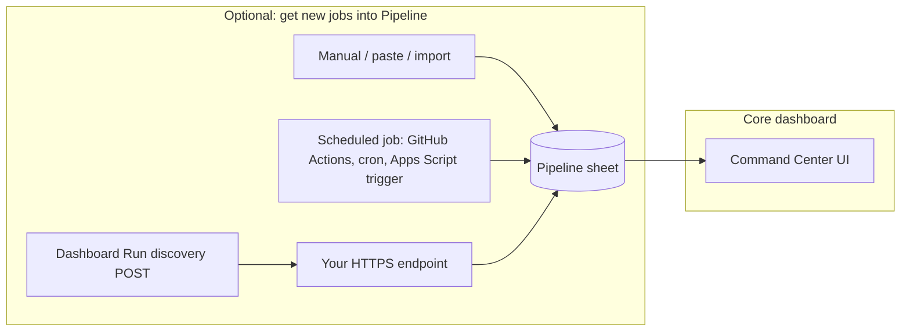
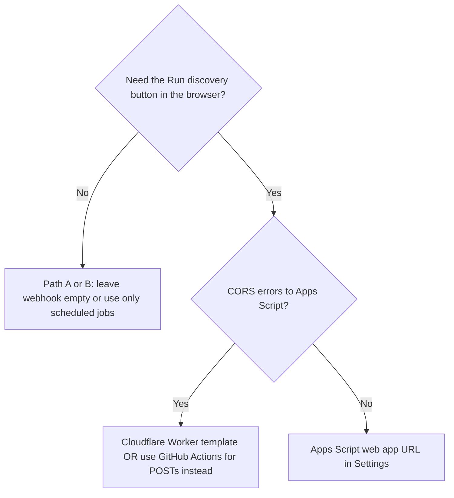

# Discovery: paths, webhooks, and alternatives

> **🆕 For newby-friendly scheduling, start here:** **[docs/SETTINGS-SCHEDULE.md](SETTINGS-SCHEDULE.md)** — a three-tier ladder (browser tab / local OS / GitHub Actions) all configurable from **Settings → Profile → Schedule** in the dashboard. The rest of this doc is the underlying reference material for custom setups and edge cases.

Command Center can **show and edit** jobs that already live in your **Pipeline** sheet. **Discovery** is the optional step of _finding_ new roles and adding rows. This doc maps **every common path** — with webhooks, without webhooks, and hybrid — so you can pick what matches your comfort level.

---

## Big picture (two separate ideas)

| Idea                             | What it means                                                                                                                                                                                                               |
| -------------------------------- | --------------------------------------------------------------------------------------------------------------------------------------------------------------------------------------------------------------------------- |
| **Pipeline data**                | Rows in Google Sheets. The dashboard reads/writes them. **No webhook required** to use the app for tracking.                                                                                                                |
| **“Run discovery” / automation** | Something adds or updates rows (agents, scripts, imports). That _might_ use an **HTTPS URL** the dashboard can POST to — **or** it might run **only on a schedule** or **only inside Google** with **no** dashboard button. |

---

## Path A — No webhook at all (simplest)

**Use the dashboard without ever setting a discovery webhook.**

| How you add jobs                                                      | Notes                                                                                                                               |
| --------------------------------------------------------------------- | ----------------------------------------------------------------------------------------------------------------------------------- |
| **Type or paste** into the Sheet                                      | Pipeline columns match [AGENT_CONTRACT.md](../AGENT_CONTRACT.md) / [schemas/pipeline-row.v1.json](../schemas/pipeline-row.v1.json). |
| **Copy rows** from another tab or file                                | Same.                                                                                                                               |
| **Third-party tools** that write to Sheets (Zapier, manual n8n, etc.) | No Command Center webhook involved.                                                                                                 |
| **Browser extensions / bookmarklets**                                 | If they write to the Sheet, you’re done.                                                                                            |

**Trade-off:** There is nothing for **Run discovery** to call; leave **Discovery webhook URL** empty. The button stays disabled until you add a URL (by design). You are **not** blocked from using Pipeline, Daily Brief, or write-back.

---

## Path B — Automation without the dashboard POST (no “browser → webhook”)

Automation runs **on a schedule or manually** and talks to **your** endpoint or **Sheets API** directly. The **dashboard never POSTs**.

| Mechanism                                        | Link                                                                                                | Typical use                                                                                                   |
| ------------------------------------------------ | --------------------------------------------------------------------------------------------------- | ------------------------------------------------------------------------------------------------------------- |
| **GitHub Actions** `curl` to Apps Script `/exec` | [templates/github-actions/README.md](../templates/github-actions/README.md)                         | Daily discovery; **no CORS** (runs on GitHub servers).                                                        |
| **Apps Script time-driven trigger**              | [Apps Script triggers](https://developers.google.com/apps-script/guides/triggers)                   | Runs inside Google; no public URL required for _scheduling_ (you may still deploy a web app for other flows). |
| **n8n / Zapier / Make**                          | [integrations/n8n/](../integrations/n8n/)                                                           | Schedule or event-driven writes to Sheets.                                                                    |
| **Local agent + cron**                           | Hermes, OpenClaw, [integrations/openclaw-command-center/](../integrations/openclaw-command-center/) | Writes rows via Sheets API or CSV; no dashboard webhook.                                                      |

**Trade-off:** **Run discovery** in the UI is optional. Many users only use **scheduled** discovery.

---

## Path C — Dashboard “Run discovery” + HTTPS webhook

You want the button to **POST JSON** to an URL you control (contract: [AGENT_CONTRACT.md](../AGENT_CONTRACT.md) interface B).

| Step                             | Resource                                                                                                          |
| -------------------------------- | ----------------------------------------------------------------------------------------------------------------- |
| Deploy receiver (stub / wiring)  | **[Google Apps Script walkthrough](../integrations/apps-script/WALKTHROUGH.md)** (step-by-step, clasp + browser). |
| Local receiver on your machine   | `npm run discovery:bootstrap-local`, then **Settings → Hermes + ngrok**, plus [integrations/openclaw-command-center/README.md](../integrations/openclaw-command-center/README.md). |
| Validate the URL                 | `npm run test:discovery-webhook` (see [examples/README.md](../examples/README.md)).                               |
| Browser POST blocked (CORS)      | [templates/cloudflare-worker/](../templates/cloudflare-worker/) (CORS relay) or Path B (server-side POST only).   |

**Trade-off:** Each user (or team) deploys **their own** endpoint in **their** account — the repo ships **templates**, not a shared global URL ([why](../integrations/apps-script/README.md#who-needs-to-deploy)). The bundled Apps Script path is a **stub** unless you replace it with real discovery logic. For a local agent, keep these roles separate: **local webhook = real engine**, **ngrok URL = public tunnel**, **Cloudflare Worker URL = browser-facing endpoint saved in JobBored**.

**Recommended: enable the SerpApi Google Jobs source for high-recall matches.** Once the local worker is running, add `SERPAPI_API_KEY=...` to `integrations/browser-use-discovery/.env` and restart. Free tier = 100 searches/mo (~20 daily runs). Without it, the worker still runs but produces far fewer matches because it falls back to scraping individual career pages that often block scrapers. Get a key at [serpapi.com](https://serpapi.com/users/sign_up). Full instructions: [SETUP.md → Recommended: enable the SerpApi Google Jobs source](../SETUP.md#recommended-enable-the-serpapi-google-jobs-source).

---

## Path D — Hybrid (recommended for many setups)

1. **Schedule** discovery with **GitHub Actions** or **Apps Script triggers** (reliable, no CORS drama).
2. Optionally add **Apps Script web app** + **Cloudflare Worker** if you also want **Run discovery** from the browser, but treat the bundled Apps Script code as webhook verification only.
3. If the real engine is local, use **local webhook → ngrok → Cloudflare Worker** instead of pasting the local URL into the dashboard.
4. Use **`npm run test:discovery-webhook`** after any deploy to confirm **`ok: true`**.

---

## Quick decision

---

## Related links

| Doc                                                                                   | Purpose                          |
| ------------------------------------------------------------------------------------- | -------------------------------- |
| [integrations/apps-script/WALKTHROUGH.md](../integrations/apps-script/WALKTHROUGH.md) | Visual Apps Script + clasp steps |
| [SETUP.md — BYO automation](../SETUP.md#byo-automation-templates)                     | Template index                   |
| [AUTOMATION_PLAN.md](../AUTOMATION_PLAN.md)                                           | Roadmap                          |
| [AGENT_CONTRACT.md](../AGENT_CONTRACT.md)                                             | JSON contract for discovery POST |
