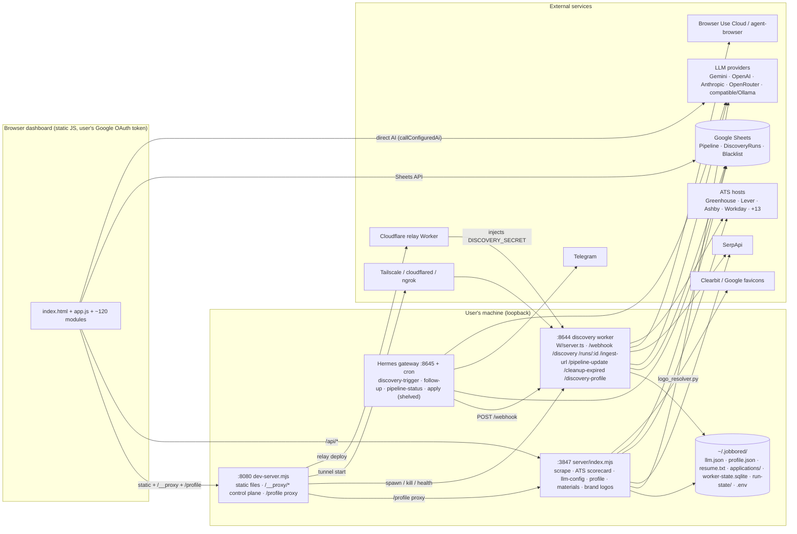

# BEAUDIT — backend inventory

Pinned SHA `f227fbb`. Every `path:line` below is at that SHA. `W/` = `integrations/browser-use-discovery/src/`. Source: the eight lane reports in `reports/`, merged without edits to their rows. The coverage appendix at the end lists every tracked backend file with its owning lane.

## System map

Trust boundaries that the audit found weak: loopback listeners trust the `Host` header (E1, G2, G3); the relay injects the worker secret for anonymous callers (G1); the worker crashes on a malformed path before any auth (A1); three fetch paths bypass the SSRF primitive (C1, C2, D15).

## Lane A — Ingress and run lifecycle

Owning lane report: `reports/LANE-REPORT-A.md` §2.

**HTTP entrypoints.** All are served by `server.ts:1016` (`createServer`) and listen at `server.ts:1645`. The shared pre-route steps are: `new URL(request.url)` at :1021 (outside any try), the origin guard at :1047, OPTIONS at :1059, and the secret pre-auth for POST routes at :1184.

| Route | Router `path:line` | Handler `path:line` | Caller | Reads | Writes / external | Test file |
|---|---|---|---|---|---|---|
| `GET /health` (no auth) | server.ts:1073 | `buildHealthPayload` server.ts:694 | dashboard readiness, wizard, doctor | worker-config.json, memory sqlite counts, credential readiness (live Sheets GET when a service account or OAuth credential is set) | none (Google verify call) | none boots it |
| `GET /runs/:id` | server.ts:1078 | `parseRunStatusPath` run-status-auth.ts:64; token check run-status-auth.ts:119 (hosted only) | dashboard poller | run-status store (memory) | none | tests/webhook/origin-guard.test.ts, handle-discovery-webhook.test.ts |
| `POST /webhook`, `/discovery`, `/` | server.ts:1154, 1559 | `handleDiscoveryWebhook` handle-discovery-webhook.ts:94 | dashboard Run discovery, schedulers, relay | body, worker-config, credential readiness | run-status snapshot; async `runDiscovery` (lane B) → Pipeline + DiscoveryRuns Sheets | tests/webhook/handle-discovery-webhook.test.ts (73), preflight-credential-order.test.ts, routing-enforcement.test.ts |
| `POST /discovery-profile` | server.ts:1214 | handle-discovery-profile.ts:1106 | dashboard profile/company suggest, schedule-save | body (resume text, form), worker-config | LLM extract + discover (paid), `upsertStoredWorkerConfig` config.ts:888, DiscoveryRuns row via the global logger | tests/webhook/handle-discovery-profile.test.ts (31), -schedule.test.ts, discovery-profile-trigger.test.ts |
| `POST /pipeline-update` | server.ts:1301 | handle-pipeline-update.ts:104 | external agents only; no in-repo caller except `scripts/test-pipeline-update-contract.mjs` | body | Sheets patch through `createPipelinePatcher` sheets/pipeline-patcher.ts:154 (lane D) | tests/webhook/handle-pipeline-update.test.ts (12) |
| `POST /ingest-url` (sync, or `async:true`) | server.ts:1385 | handle-ingest-url.ts:122; async path handle-ingest-url.ts:490 | dashboard `ingest-url-flow.js` | body, worker-config (sheetId fallback) | ATS public API, Gemini URL-context (paid), Browser Use Cloud (paid), cheerio scrape; Pipeline write handle-ingest-url.ts:996 | tests/webhook/handle-ingest-url.test.ts (35) |
| `POST /cleanup-expired` | server.ts:1477 | handle-cleanup-webhook.ts:30 | dashboard expired review, `scripts/run-scheduled-expired-cleanup.mjs` | body | `runExpiredJobCleanup` (lane D), fetches each job URL, Sheets write when `dryRun:false` | tests/webhook/handle-cleanup-webhook.test.ts (7) |

**Stores.**

| Store | Code | Location | Written by | Test |
|---|---|---|---|---|
| Run status (in-memory Map plus one JSON snapshot per run; atomic tmp+fsync+rename) | run-status-store.ts:169, put :183, write :319 | `~/.jobbored/browser-use-discovery/run-state/` (config.ts:303-308) | webhook, ingest, safety timer, boot recovery | tests/state/run-status-store.test.ts (13) |
| Stored worker config (read-modify-write with no lock; grouped multi-Sheet envelopes) | config.ts:854 load, :888 upsert; effective-intent.ts:301/316 | `~/.jobbored/browser-use-discovery/worker-config.json` | /discovery-profile persist, schedule-save | tests/webhook/handle-discovery-profile*.test.ts |
| Runtime env | config.ts:776 `mergeRuntimeEnvWithDotEnv`, :813 parser | `~/.jobbored/browser-use-discovery/.env`, or an explicit `BROWSER_USE_DISCOVERY_ENV_FILE` | read-only | tests/webhook/config.test.ts |
| Discovery memory sqlite | server.ts:76 (lane B owns) | `worker-state.sqlite` | run loop | lane B |

**Background jobs and timers.**

| Job | Code | Bound |
|---|---|---|
| Async discovery dispatch | handle-discovery-webhook.ts:418-492 | run-wide abort run-abort.ts:128 (armed in run-discovery.ts:297) plus safety timer |
| Status safety timer (status-only watchdog) | safety-timer.ts:45, used at handle-discovery-webhook.ts:406 and handle-ingest-url.ts:518 | `maxRunDurationMs`, default 60 min (config.ts:127, 437); ingest default 5 min |
| Boot recovery (non-terminal → failed) | server.ts:283 → run-status-store.ts:221 | once, at boot |
| Async ingest dispatch | handle-ingest-url.ts:533-618 | safety timer |
| Terminal history finalizer (first write wins, one DiscoveryRuns row) | sheets/discovery-runs-writer.ts:63, wired at handle-discovery-webhook.ts:277-305 | — |

**Order invariant per route** (method → secret → parse → token strip → preflight → first side effect → run):

| Route | Order observed | Holds? |
|---|---|---|
| /webhook, /discovery, / | URL parse :1021 (can throw, A1) → origin :1047 → method :1169 → secret :1184 → body :1560 → handler: method :98, secret :111, parse :127, auth-probe exit :137, token strip :180-189, preflight :238, first write :275, dispatch :418 | Yes, except the pre-route URL parse (A1). Preflight receives the unstripped request (:239), but it is never logged. |
| /runs/:id | URL parse → origin → method :1079 → path parse (decode caught) :1094 → hosted token or secret :1104 → store read | Yes. Local mode has no auth by design. |
| /discovery-profile | method → secret → body → parse → paid LLM extract → config write + history row | Yes. No preflight exists; the paid LLM call is the first side effect. |
| /pipeline-update | method → secret → body → full parse and validation :43-102 → Sheets patch | Yes (P2-PIPEUPD fixed) |
| /ingest-url | method → secret → body → parse → token held in deps → sheetId resolve → classify → **paid extraction** → credential resolved only at write :1003 | **No** (A3): paid extraction runs before any credential check |
| /cleanup-expired | method → secret → body → sheetId → run (fetches job URLs) | Yes. No credential preflight; a failure maps to a 500 with detail. |

## Lane B — Discovery engine

Owning lane report: `reports/LANE-REPORT-B.md` §2.

| Item | Kind | path:line @f227fbb | Caller | Reads | Writes / external | Test |
|---|---|---|---|---|---|---|
| `runDiscovery` | run entry (job) | `W/run/run-discovery.ts:285` | webhook dispatcher (deps built at `W/server.ts:296`) | stored worker config, request, disk profile (`loadUserProfile`), memory snapshot | pipelineWriter (Sheets), DiscoveryRuns logger, memory store, progress checkpoints | `tests/webhook/run-discovery.test.ts`, `tests/run/f4b-named-claims.test.ts` |
| ATS seed assembly | stage | `run-discovery.ts:475-672` | runDiscovery | `loadSnapshot` (company_registry, career_surfaces), config atsCompanies | Gemini google_search `searchAtsHosts` fallback (`:581`) | run-discovery.test (VAL-LOOP-ATS) |
| ATS lane | stage | `run-discovery.ts:679-840` | runDiscovery | `detectBoards`, `adapter.listJobs`/`collectListings` | ATS fetch (lane C), matcher + profile LLM per listing (sequential) | run-discovery.test |
| Grounded scout | stage | `run-discovery.ts:870-960` | runDiscovery | config.companies | 1 Gemini google_search per company (`W/grounding/grounded-search.ts:712`) | grounded-search.test |
| SerpApi lane | stage | `run-discovery.ts:966-1063` | runDiscovery | serpApiKey | SerpApi (lane C), LLM per listing | serpapi-google-jobs.test |
| Frontier score/select | stage (pure) | `run-discovery.ts:1065-1187`; `W/run/frontier-scorer.ts:374,548` | runDiscovery | normalized leads + scout candidates | none | `tests/run/frontier-scorer.test.ts` |
| Grounded exploit | stage | `run-discovery.ts:1189-1228,2039-2385`; `grounded-search.ts:1109` | runDiscovery | scout cache | Gemini prose recovery (`:1202`), structuring (`:1265`), hint resolve (`:1555`), preflight `safeFetch` (`:2200`), Browser Use `sessionManager.run` (`:1350`), dead-link memory | grounded-search.test |
| Dedupe / restrict / select-for-write | stage | `run-discovery.ts:1244-1311,2551-2777`; `W/normalize/intake-identity.ts:124` | runDiscovery | leads | none | `tests/sheets/lead-normalizer-fingerprint.test.ts` (F1D-RUN09-LOC) |
| Write | external | `run-discovery.ts:1313-1363` | runDiscovery | leads | Sheets append (lane D) | pipeline-writer.test |
| Learn | store | `run-discovery.ts:1427-1538` | runDiscovery | extraction results | `writeExploitOutcome`, `learnRoleFamilyFromLead` (SQLite) | discovery-memory-store.test |
| DiscoveryRuns log | external | `run-discovery.ts:1547-1590` | runDiscovery | lifecycle | Sheets DiscoveryRuns tab | run-discovery-runs-log.test |
| Lifecycle / failure classifier | pure | `run-discovery.ts:2481-2549,2853-2968` | runDiscovery | warnings, counters | none | run-discovery.test |
| Effective intent / pools / sources | pure | `W/discovery/effective-intent.ts:106,181,207`; used `W/config.ts:941-1043` | mergeDiscoveryConfig; webhook guard `W/webhook/handle-discovery-webhook.ts:574,752` | request, stored config | none | `tests/discovery/effective-intent.test.ts` |
| Retry-broadening gate | pure | `W/run/retry-broadening.ts:20`; used `grounded-search.ts:415` | grounded search ladder | ultraPlanTuning | gates outbound Gemini rungs | `tests/run/retry-broadening.test.ts`, f4b RUN06 |
| Run budget tracker | in-memory | `W/run/budget-tracker.ts:116` | runDiscovery `:322,910,2070` | wall clock | progress checkpoints | `tests/run/budget-tracker.test.ts` |
| Grounded search client | external | `grounded-search.ts:705-1083` (`search`, `searchAtsHosts`, `resolveHint`) | runDiscovery | geminiApiKey (sent as the `x-goog-api-key` header) | Gemini generateContent + google_search | grounded-search*.test |
| Gemini request + retry | external | `grounded-search.ts:3666,4329` | grounded client, structuring | — | Gemini | grounded-search.test |
| Worker chat provider | external | `W/ai/chat-provider.ts:80,159` | matcher `W/match/job-matcher.ts:302`; profile scorer `W/normalize/profile-aware-scorer.ts:306`; `W/discovery/profile-to-companies.ts:487,1089` | runtimeConfig provider keys | Gemini / OpenAI / OpenRouter / Anthropic / OpenAI-compatible, **no timeout** | job-matcher.test |
| AI matcher | external | `job-matcher.ts:276` (cap `max(4,min(12,maxLeadsPerRun))`), `:291` | `run-discovery.ts:1689` | baseline decision | chat provider | job-matcher.test |
| Profile LLM scorer | external | `profile-aware-scorer.ts:403` (pre-filter `:408`, cache `:420`) | `W/normalize/lead-normalizer.ts:273`; only when the request carries mergedUserProfile (`run-discovery.ts:367`) | profile | chat provider; uncapped | lead-normalizer-llm-trust.test (injects a cache) |
| Discovery memory store | store (SQLite at `~/.jobbored/browser-use-discovery/worker-state.sqlite`) | `W/state/discovery-memory-store.ts:580` | `W/server.ts:75` | — | 9 tables (counts `:1207`) | `tests/state/discovery-memory-store.test.ts` |
| Run memory adapter | store facade | `W/state/run-discovery-memory-store.ts:50` | server deps | loadPlannerSnapshot | exploit outcomes, role families | run-discovery.test |
| Listing score cache | store | `W/state/listing-score-cache.ts:29` | **no production caller** | — | — | canned caches in tests only |
| Company planner | pure | `W/discovery/company-planner.ts:207` | `W/server.ts:79-100` object; **never called by runDiscovery** | — | — | `tests/discovery/company-planner.test.ts` |
| Profile→companies | external (LLM) | `W/discovery/profile-to-companies.ts:1089` | `W/webhook/handle-discovery-profile.ts` (lane A route) | profile | chat provider | profile-to-companies.test |
| Career surface policy | pure | `W/discovery/career-surface-resolver.ts` (`classifyCareerSurfaceSourcePolicy`, used `run-discovery.ts:1007`) | run, grounded search | URL | none (lane C owns fetch) | career-surface-resolver.test |
| Listing fingerprint | pure | `W/discovery/listing-fingerprint.ts:301,405,457` | intake-identity, pipeline writer | listing | none | listing-fingerprint.test |

## Lane C — Sources and ATS providers

Owning lane report: `reports/LANE-REPORT-C.md` §2.

| # | Kind | Item (`path:line` @ f227fbb) | Caller | Reads / writes | Test file |
|---|---|---|---|---|---|
| 1 | External call (SSRF primitive) | `server/security-boundaries.mjs:313` `safeFetch`: validates each hop, DNS-pins at connect (`:433`, `:489`), up to 5 redirects | all shared fetchers; worker via `W/net/safe-fetch.ts:26` | reads the network; buffers the whole body in memory (`:517-534`) | `tests/safe-fetch-dns-pin.test.mjs`, `tests/server-security-boundaries.test.mjs`, `W/../tests/sources/safe-fetch.test.ts` |
| 2 | External call | `W/net/safe-fetch.ts:26`: thin re-export of #1 | `W/browser/providers/shared.ts:568`, `W/sources/ats-public-fetchers.ts:309`, `W/grounding/grounded-search.ts:2200` | — | `W/../tests/sources/safe-fetch.test.ts` |
| 3 | External call (**unguarded**) | `W/browser/session.ts:151` `runFetchSession`: raw `fetch`, follows redirects | `session.ts:25` (fallback when the command fails) and `:37` (no command); run from `grounded-search.ts:1350`, `providers/shared.ts:355`, `generic-provider.ts:109`, `greenhouse.ts:129`, `lever.ts:117`, `ashby.ts:116` | reads any URL; returns the body into listings | `W/../tests/browser/session.test.ts` (pins the unguarded fallback) |
| 4 | Background process (**unguarded**) | `W/browser/session.ts:58` spawns `runtimeConfig.browserUseCommand`, which defaults to `bin/browser-use-agent-browser.mjs` (`W/config.ts:753-776`), which runs `agent-browser open <url>` (`bin/…:51-56`) | same as #3 | headless browser to any URL | `W/../tests/browser/session.test.ts` |
| 5 | Registry | `W/browser/providers/index.ts:25`: 14 browser ATS providers; `detectSurfaces` uses `allSettled` plus a 12 s timeout that does not abort (`:84`) | `W/browser/source-adapters.ts:99` | preflight GETs through `providers/shared.ts:521/538` (8 s timeout, `:27`) | `W/../tests/browser/source-adapters*.test.ts`, `selectors.test.ts` |
| 6 | Adapter layer | `W/browser/source-adapters.ts:58` `collectBoardListingsSettled`, `:99` registry | `W/server.ts:70`, then `run-discovery.ts` | — | `W/../tests/browser/source-adapters.test.ts:441` |
| 7 | External call | `W/sources/ats-public-fetchers.ts:121/176/232`: Greenhouse, Lever and Ashby single-job JSON through safeFetch | `W/webhook/handle-ingest-url.ts:27` (ats_direct) | GET the public ATS APIs | `W/../tests/sources/ats-public-fetchers.test.ts` |
| 8 | Dead code | `W/sources/ats-public-fetchers.ts:48/71/78/100` `selectRegisteredAtsSources`, `hasRegisteredAtsExecutionLane`, `resolveAtsPublicExecution`, `fetchAtsJobByRegistry` | **tests only** (grep in §4) | — | `ats-public-fetchers.test.ts:156-215` |
| 9 | External call | `W/sources/serpapi-google-jobs.ts:99/498`: the worker's SerpApi client (paid) | `run-discovery.ts:~975-1050`, `W/discovery/profile-to-companies.ts` | GET `serpapi.com` with `api_key` in the query | `W/../tests/sources/serpapi-google-jobs.test.ts` |
| 10 | External call | `W/sources/gemini-url-context-extractor.ts:65/266`: Gemini url_context (paid), raw fetchImpl to a fixed host | `handle-ingest-url.ts:1033` | POST to googleapis | `W/../tests/webhook/handle-ingest-url.test.ts` (stubbed) |
| 11 | External call | `W/sources/browser-use-cloud-extractor.ts:49`: Browser Use Cloud SDK (paid) | `handle-ingest-url.ts:1093` | cloud task | `handle-ingest-url.test.ts` (stubbed) |
| 12 | Pure | `W/sources/ingest-url-router.ts:21` `classifyIngestUrl`; `W/sources/host-signatures.ts:13/30` host tables | `handle-ingest-url.ts:36`, `serpapi-google-jobs.ts:590-597`, `run-discovery.ts` | — | `W/../tests/sources/ingest-url-router.test.ts` |
| 13 | Pure policy | `W/discovery/career-surface-resolver.ts:279` `classifyCareerSurfaceSourcePolicy` (literal-only private check `:385`); job-board list `:57` | `grounded-search.ts:3257`, `run-discovery.ts:1007` | — | `W/../tests/browser/career-surface-resolver.test.ts` |
| 14 | Pure | `W/browser/runtime-readiness.ts:42/124` readiness checks | `W/server.ts` | reads env and PATH | `W/../tests/browser/runtime-readiness.test.ts` |
| 15 | Store | `W/browser/providers/frontier-memory.ts:41/84`: in-memory frontier signals (no disk) | providers | memory snapshot passed in | `W/../tests/browser/frontier-memory.test.ts` |
| 16 | Entrypoint (library) | `server/shared/job-scraper-core.mjs:1429` `scrapeJobPosting`: ATS API, then HTML (2 attempts, `:1394`), then SerpApi, then Gemini (`:1695`) | `server/job-scraper.mjs:5` (/api/scrape-job, lane E), `server/profile-rescore-worker.mjs:34`, `server/materials-drafter.mjs:19`, `W/webhook/handle-ingest-url.ts:1342` | GET the job page; paid SerpApi and Gemini | `tests/job-scraper-*.test.mjs`, `tests/scrape-failure-ux.test.mjs` |
| 17 | External call | `server/shared/job-scraper-core.mjs:663` SerpApi client (second copy of #9) | `:697`, `:750` | GET serpapi.com | `tests/job-scraper-linkedin-fallback.test.mjs` |
| 18 | External call | `server/shared/ats-job-fetchers.mjs:182` `fetchAtsJobPosting`: 16 providers plus a generic feed (`:973`, 4 parallel probes) through `fetchJsonValue`/`fetchText` (`:1103/1142`), 12 s timeout | #16 | GET public ATS APIs | `tests/job-scraper-ats-api.test.mjs` (27 tests) |
| 19 | External call | `server/shared/gemini-url-context-scrape.mjs:21`: Gemini url_context through safeFetch with `x-goog-api-key` | #16 `:1698` | POST to googleapis | `tests/job-scraper-gemini-url-context.test.mjs` (2 tests) |
| 20 | Pure | `server/shared/text-normalize.mjs:25-79` HTML/text normalizers | #16, #18, #19 | — | `tests/text-normalize.test.mjs` |

**Fetch-layer map (seed Q1)**

| Concern | Worker site | Shared/server site | Callers |
|---|---|---|---|
| Single-job ATS JSON (Greenhouse, Lever, Ashby) | `W/sources/ats-public-fetchers.ts:121-290` | `server/shared/ats-job-fetchers.mjs:272-360` | worker `/ingest-url` uses the worker copy first, then calls shared `scrapeJobPosting`, which re-fetches the same ATS API |
| ATS URL identity parsing | `W/sources/ingest-url-router.ts:82` (4 providers) | `server/shared/ats-job-fetchers.mjs:18` (16 providers) | — |
| SerpApi client | `W/sources/serpapi-google-jobs.ts:498` | `server/shared/job-scraper-core.mjs:663` | run vs scrape |
| Gemini url_context | `W/sources/gemini-url-context-extractor.ts` (408 lines) | `server/shared/gemini-url-context-scrape.mjs` (172 lines) | ingest vs scrape |
| Private-IP classifier | `W/discovery/career-surface-resolver.ts:315-412` | `server/security-boundaries.mjs:152-250` | copy-pasted |
| Job-board host list | `career-surface-resolver.ts:57` and `sources/host-signatures.ts:30` | `job-scraper-core.mjs` placeholder/employer lists | lists disagree (C6) |

**Keep `server/shared`** for single-job fetch (16 providers against 3, 27 fixture tests, safeFetch everywhere, structured `ScrapeJobError`). **Keep the worker `browser/providers`** for board enumeration, which has no shared equivalent. Migration list:
1. Delete `W/sources/ats-public-fetchers.ts:100-424` and have `handle-ingest-url.ts:897` call `fetchAtsJobPosting`.
2. Replace `ingest-url-router.ts:82` with `parseAtsJobIdentity`.
3. Make the worker Gemini extractor delegate to `scrapeViaGeminiUrlContext`.
4. Collapse the two SerpApi clients into one module that takes a key.
5. Import `isPrivateNetworkHostname` from `security-boundaries.mjs` in place of the resolver copy.
6. Keep one host-signature table.

**Provider × coverage table (seed Q2).** Worker registry: 14 providers. Shared fetcher: 16 plus the generic feed (the "17" in the brief). Columns: fetch, parse, fixture test (payload-shaped stub), error path tested.

| Provider | Worker enumerate (fetch/parse) | Worker fixture test | Worker error test | Shared single-job (fetch/parse) | Shared fixture test | Shared error test |
|---|---|---|---|---|---|---|
| greenhouse | Y/Y | Y (source-adapters, ats-first) | Y (RUN10 settled) | Y/Y | Y | Y (listing-shell reject `:898`) |
| lever | Y/Y | Y | N | Y/Y | Y | N |
| ashby | Y/Y | Y | Y (RUN10 settled) | Y/Y | Y | N |
| smartrecruiters | Y/Y | partial (canonicalize only) | N | Y/Y | Y | N |
| workday | Y/Y | canonicalize only | N | Y/Y | Y | N |
| icims / jobvite / taleo / successfactors / breezy | Y/Y | canonicalize only (`source-adapters.test.ts:355+`) | N | **no shared fetcher** | — | — |
| workable | Y/Y | canonicalize only | N | Y/Y (`:419`) | **N (0 mentions)** | N |
| recruitee | Y/Y | canonicalize only | N | Y/Y | Y | Y (404 then list `:429`) |
| teamtailor | Y/Y | canonicalize only | N | Y/Y | Y | N |
| personio | Y/Y | canonicalize only | N | Y/Y | Y | N |
| pinpoint / rippling / bamboohr / jazzhr / gem / dover / homerun | — (not in registry) | — | — | Y/Y | Y | N |
| generic career feed | — | — | — | Y/Y (`:973`) | Y (`:823`, `:859`, `:887`) | Y (LinkedIn/blog skip) |

Eleven of the 14 worker providers have no enumerate-listings fixture test; only URL canonicalization is tested.

## Lane D — Sheets persistence and data integrity

Owning lane report: `reports/LANE-REPORT-D.md` §2.

| Kind | Entry | path:line @f227fbb | Caller | Reads | Writes | Test file |
|---|---|---|---|---|---|---|
| Worker writer | `createPipelineWriter().write` | `W/sheets/pipeline-writer.ts:663-851` | `W/run/run-discovery.ts:1326`, `W/webhook/handle-ingest-url.ts:1003` | `Pipeline!A1:Y1`, `Blacklist!A2:A`, `Pipeline!A2:Y` (full) | header upgrade `A1:Y1`; batchUpdate of full `A{n}:Y{n}` rows; append `A:Y` (USER_ENTERED) | `tests/sheets/pipeline-writer.test.ts`, `tests/sheets/intake-identity.test.ts` |
| Shared auth | `resolveAccessToken` | `W/sheets/pipeline-writer.ts:495-525` | writer, patcher, runs logger, cleanup, readiness | `googleAccessToken`, SA JSON/file, OAuth token JSON/file | nothing (refreshed token not persisted or cached) | `pipeline-writer.test.ts:540` |
| Worker patcher | `createPipelinePatcher().patch` | `W/sheets/pipeline-patcher.ts:154-225` | `POST /pipeline-update` `W/server.ts:1301-1313` | `Pipeline!A2:Y` | narrow cells L,M,N,O,R,S (USER_ENTERED) | `tests/sheets/pipeline-patcher.test.ts` |
| HTTP route | `handlePipelineUpdateWebhook` | `W/webhook/handle-pipeline-update.ts:104-134` | Hermes / scripts via `W/server.ts:1313` | body (event, schemaVersion 1, sheetId, job, fields) | via patcher | `tests/webhook/handle-pipeline-update.test.ts`, `scripts/test-pipeline-update-contract.mjs` |
| Runs logger | `appendDiscoveryRunRow`, `createTerminalHistoryFinalizer` | `W/sheets/discovery-runs-writer.ts:264-338`, `:63-96` | `runDiscovery` finalizer, `W/server.ts:275`, `:621` | `DiscoveryRuns!A1:J1` | addSheet, header PUT, append `A:J` (USER_ENTERED) | `tests/sheets/discovery-runs-writer.test.ts`, `tests/webhook/run-discovery-runs-log.test.ts` |
| Parser (dead in prod) | `parseDiscoveryRunsCells` | `W/sheets/discovery-runs-writer.ts:102-181` | tests only; browser parses separately in `runs-tab.js:103-193` | — | — | `run-discovery-runs-log.test.ts:228` |
| Readiness | `validateSheetsCredentialReadiness` | `W/sheets/credential-readiness.ts:247` (probe `:180-205`) | `GET /health` `W/server.ts:726-729`; `/webhook` preflight `W/webhook/handle-discovery-webhook.ts:632` | creds; `GET spreadsheets/{id}?fields=spreadsheetId` | nothing | `tests/webhook/credential-readiness.test.ts`, `tests/sheets/placeholder-sheet-readiness.test.ts` |
| Background job | `runExpiredJobCleanup` | `W/cleanup/expired-job-cleanup.ts:572-759` | `POST /cleanup-expired` `W/server.ts:1477` → `W/webhook/handle-cleanup-webhook.ts:30`; CLI `:798`; `npm run cleanup:expired-jobs` | `Pipeline!A1:Y1`, `A2:Y`; GETs every New/Researching Link serially (15 s timeout each) | one batchUpdate at the end: M=`Expired`, O=notes+audit | `tests/sheets/expired-job-cleanup.test.ts`, `tests/webhook/handle-cleanup-webhook.test.ts` |
| Scheduler wrapper | `run-scheduled-expired-cleanup.mjs main` | `scripts/run-scheduled-expired-cleanup.mjs:208-232` | launchd/Task Scheduler from `scripts/install-expired-cleanup-schedule.mjs:195-203` (`--total-timeout-ms` 45 min, `:58-59`) | `envPath` .env + process.env; worker-config sheetId | spawns cleanup CLI; SIGTERM at the total timeout (`:187-193`) | `tests/schedule-installers.test.ts` (args only) |
| Apps Script | `doPost`, `doGet`, `appendTestRow_` | `integrations/apps-script/Code.gs:15-63`, `:69-81`, `:83-114` | public web app ("Anyone") | body, Script Properties `SHEET_ID`, `ENABLE_TEST_ROW` | `Logger.log` of the full body (`:34`); a 17-cell `appendRow` per POST when enabled | `tests/apps-script-deploy.test.mjs` (deploy UI only; no Code.gs test) |
| Schema | Pipeline row v1 | `schemas/pipeline-row.v1.json` (25 cols, `headerRow`) | `scripts/test-pipeline-contract.mjs` (README, app-config-core, pipeline-render only) | — | — | `npm run test:pipeline-contract` |
| Browser writers (compare) | `updateJobStatus`/`getStatusSideEffects`, `markStatusExpired`, `dismissJob`/`restoreJob`, `editJobField`, `applyCells` | `sheets-writeback.js:681`, `:578-660`, `:470-498`, `:383-461`, `:521`, `:799` | board, Daily Brief, dossier, `submission-flow.js:204`, `pipeline-transitions.js:289` | local CSV snapshot (`_rawIndex`) | fixed letters M,N,O,P,R,S,V,W,B/C/D/G,Y (USER_ENTERED); Blacklist append (RAW) | `tests/pipeline-atomic-transition.test.mjs`, `pipeline-move-applied-side-effects`, `favorite-persistence`, `edit-job-field`, `pipeline-transition-adapter` |
| Browser manual append | `appendManualPipelineRowDirect` | `ingest-url-flow.js:417-482` | Add-URL fallback | local snapshot dedupe | `Pipeline!A:T` 20 cells (RAW); JD into K with a label | — |

External calls: `sheets.googleapis.com` (values get, batchUpdate, append, PUT; spreadsheets get and batchUpdate), `oauth2.googleapis.com/token` (JWT exchange or refresh on every call), and arbitrary posting URLs from the Sheet (cleanup, `W/cleanup/expired-job-cleanup.ts:444`). Stores: the user's Sheet only (tabs Pipeline, Blacklist, DiscoveryRuns). There is no worker-side lock or cache.

**Column × writer table** (✓ = writes; "—" = never)

| Col | Worker writer (append / merge) | Worker patcher `/pipeline-update` | Worker cleanup | Browser board `updateJobStatus` | Browser other paths | Apps Script stub |
|---|---|---|---|---|---|---|
| A Date Found | ✓ / keeps existing | — | — | — | manual append | `new Date()` |
| B–D Title/Company/Location | ✓ / overwrite unless Edit Lock | — (match key only) | — | — | `editJobField` + Y lock | ✓ |
| E Link | normalized / overwrite | — (match key) | read | — | manual append raw URL | ✓ |
| F Source, I Priority, J Tags, K Fit Assessment, Q Talking Points | ✓ / **overwrite when lead has a value** (D4) | — | — | — | K = user JD on manual append | ✓ (F,I,J,K) |
| G Salary | ✓ / overwrite unless locked | — | — | — | `editJobField` | — |
| H Fit Score, T Logo, U Match Score | ✓ / overwrite | — | — | — | — | H only |
| L Contact | ✓ / keeps existing | ✓ | — | — | — | — |
| M Status | "New" / keeps | ✓ (Applied: **M only**, D7) | ✓ "Expired" | ✓ + side effects | `markStatusExpired`: **M only** (D10) | "New" |
| N Applied Date | — | ✓ free string | — | ✓ today on Applied (ignores confirmed date, D11) | planner: confirmed date | — |
| O Notes | — | ✓ RMW prepend (D8) | ✓ RMW append audit (D3) | — | `updateJobNotes` full overwrite; planner appends | — |
| P Follow-up | — | — | **not cleared** on Expired | ✓ set/clear by stage | `markStatusExpired` doesn't clear | — |
| R Last contact, S Did they reply? | — / keeps | ✓ | — | — | ✓ | — |
| V Favorite, W Dismissed At | ✓ only when truthy | — | — (does not skip dismissed rows) | — | ✓ + Blacklist tab | — |
| X Approval Status | "" / keeps | — | — | — | — | — |
| Y Edit Lock | "" / honoured for B,C,D,G | — | — | — | ✓ | — |

## Lane E — Scraper/ATS API and AI provider layer

Owning lane report: `reports/LANE-REPORT-E.md` §2.

| Item | path:line | Caller | Reads / writes | External calls | Test file |
|---|---|---|---|---|---|
| CORS/origin middleware | server/index.mjs:177-205 → security-boundaries.mjs:38-96 | every request | Origin, Host headers | — | tests/server-security-boundaries.test.mjs, tests/server-hosted-auth-boundary.test.mjs |
| API-token gate (non-loopback only) | server/index.mjs:87-142, :219-222 | every non-/health request | JOBBORED_API_TOKEN / API_ACCESS_TOKEN env | — | tests/server-hosted-auth-boundary.test.mjs |
| JSON body 2 MB + error handler | server/index.mjs:206, :859-880 | all JSON routes | — | — | tests/server-error-schema.test.mjs |
| GET /health | server/index.mjs:208-217 | setup/status probes | reads ~/.jobbored/llm.json (ats-scorecard.mjs:969); **migrates env→llm.json as a side effect** (ats-scorecard.mjs:861, llm-config.mjs:188-197) | — | tests/server-hosted-auth-boundary.test.mjs |
| GET /api/llm-config | index.mjs:234 → llm-config.mjs:291-298 | Settings | reads ~/.jobbored/llm.json (redacted) | — | tests/llm-config-endpoint.test.mjs |
| POST /api/llm-config | index.mjs:235 → llm-config.mjs:305-316 | settings-modal.js:294-321 (:932), oneflow-beat-ai.js:524-547 (:669) | full-replace write of ~/.jobbored/llm.json (0600, non-atomic, llm-config.mjs:102-107) | — | tests/llm-config-endpoint.test.mjs, tests/llm-config.test.mjs |
| POST /api/scrape-job | index.mjs:237-259 → shared/job-scraper-core.mjs:1429 | posting-enrichment.js:288, discovery-drawer.js:1604 | none (stateless) | DNS preflight (security-boundaries.mjs:284); ATS public APIs (shared/ats-job-fetchers.mjs, 12 s); page GET ×≤2 (job-scraper-core.mjs:1394-1419, 18 s, 4 MB); SerpApi google_jobs (:663, 12 s, env SERPAPI key); Gemini URL-context (shared/gemini-url-context-scrape.mjs:21, 25 s, env GEMINI key) | tests/job-scraper-*.test.mjs, tests/safe-fetch-dns-pin.test.mjs |
| POST /api/ats-scorecard | index.mjs:261-311 → ats-request-payload.mjs:421, ats-scorecard.mjs:1041 | ats-scorecard.js:208 (via scraper-ats-config.js:67) | reads llm.json pin | 1 LLM call (Gemini/OpenAI/Anthropic/OpenRouter/compat), +1 retry on malformed JSON (ats-scorecard.mjs:213), +1 Gemini models.list when pin model is `gemini-flash` (llm-config.mjs:233-276); 30 s timeout (ats-scorecard.mjs:93, :386) | tests/ats-scorecard-provider.test.mjs, tests/ats-request-transport-alignment.test.mjs, tests/llm-pin-consumers.test.mjs |
| GET /api/brand-logos | index.mjs:386-393 → brand-logos.mjs:462 | fit-profile-editor.js:144 | reads template logos.json and assets; **mkdirs assets/ and uploads/ on GET** (:473-484) | — | tests/brand-logos-endpoint.test.mjs |
| POST /api/brand-logos/resolve | index.mjs:395-403 → brand-logos.mjs:222 | fit-profile-editor.js:153 | writes template assets | spawns `python3 integrations/hermes-job-hunt/scripts/logo_resolver.py` (45 s), which fetches favicons | tests/brand-logos-endpoint.test.mjs |
| POST /api/brand-logos/:slug | index.mjs:405-414 → brand-logos.mjs:424, :501 | fit-profile-editor.js:172 | writes uploads/logo-<slug>.png plus logos.json, then runs the resolver with force | python3 resolver | tests/brand-logos-endpoint.test.mjs |
| Startup job: Hermes applications migration | index.mjs:892 | app.listen | ~/.hermes → ~/.jobbored/applications (lane F) | — | (lane F) |
| CLI `node server/job-scraper.mjs <url>` | server/job-scraper.mjs:9-19 | `npm run scrape` | stdout | same as scrape-job | none |
| Store ~/.jobbored/llm.json (the single pin) | llm-config.mjs:49-53 | ATS, materials-drafter.mjs:470, profile-from-resume.mjs:387, profile-rescore-worker.mjs:746, worker config.ts:479 | — | — | tests/llm-config.test.mjs |
| Deploy: Docker | server/Dockerfile:1-17, server/.dockerignore | manual `docker build server/` | context = server/ only | npm registry | tests/server-dockerignore.test.mjs (.env patterns only) |
| Deploy: Render | render.yaml:1-11 (rootDir server, `npm install`, LISTEN_HOST=0.0.0.0) | Render Blueprint | — | — | none |
| tsconfig gate | server/tsconfig.json (checkJs strict over *.mjs, shared/*.mjs) | `npm run typecheck` | — | — | CI |

**AI-provider abstractions (seed Q1): seven, not three.**
| # | Site | Providers | Key source | Timeout | Retry | Error mapping |
|---|---|---|---|---|---|---|
| 1 | server ATS `ats-scorecard.mjs:611-824` | gemini, openai, anthropic, openrouter, openai_compatible (**not `local`**) | llm.json pin only (env feeds a one-time migration) | 30 s, env max 120 s | 1× on malformed JSON | ProviderApiError {provider, upstreamStatus, providerCode, classification, retryable}; body not echoed |
| 2 | server profile-from-resume `profile-from-resume.mjs:387-470, :1214` | +local | pin, else per-feature env chains (PROFILE_* → ATS_* → vendor) | own | own | own |
| 3 | server rescore `profile-rescore-worker.mjs:140-236, :739-780` | +local, ollama alias (:675) | pin, else PROFILE_RESCORE_* env chains | PROFILE_RESCORE_TIMEOUT_MS / ATS_PROVIDER_TIMEOUT_MS | own | reason/detail codes |
| 4 | server materials-drafter `materials-drafter.mjs:123, :470` | incl. webhook/local | pin | own | own | own |
| 5 | server scraper Gemini URL-context `shared/gemini-url-context-scrape.mjs:21-99` | gemini only | **env ATS_GEMINI_API_KEY/GEMINI_API_KEY; ignores the pin** | 25 s | none | returns null |
| 6 | worker `integrations/browser-use-discovery/src/ai/chat-provider.ts:80-440` | gemini, anthropic, openai, openrouter, openai-compatible | runtime-config key chains (~10 aliases per field) plus pin via config.ts:479 | caller signal only | none | `Error("
 HTTP n: <first 200 chars of upstream body>")` (:150-154) — unredacted body |
| 7 | browser `resume-generate.js:445-655` (`callConfiguredAi`; discovery-drawer.js:1311 delegates) | openrouter, local, openai, anthropic, gemini, webhook | browser config/storage | none found | none | thrown strings |
(Hermes model chain is a further one, lane H.)
**Sketch of the one to keep:** `server/ai/provider.mjs`, one module, ESM, importable by the worker (it already imports server/llm-config.mjs). It exports `resolveProvider(pin)` and `chat({messages, schema, signal, maxTokens})`. It holds one provider enum `{gemini, openai, anthropic, openrouter, openai_compatible}` with aliases `local|ollama → openai_compatible`, a pin-only key source, a header-based Gemini key, and `AbortSignal.any([timeout, request])`. It carries a single ProviderApiError taxonomy (ATS's, rows 1) and redacts upstream bodies. Features pass a prompt and a schema only. The browser keeps a thin client that POSTs to `/api/ai/chat` for local and hosted, with a direct-browser path only where the user opts in. This deletes rows 2–5 and folds row 6 into a re-export.

## Lane F — Profile and materials pipeline

Owning lane report: `reports/LANE-REPORT-F.md` §2.

| Item | path:line | Caller | Reads | Writes / external | Test |
|---|---|---|---|---|---|
| GET /profile | server/index.mjs:322 | Settings, wizard | profile.json (no validation, user-profile.mjs:91) | — | profile-api-base, e2e/profile-flow-smoke |
| POST /profile | index.mjs:340 | Fit Profile save | body | profile.json + .bak.<ts> (user-profile.mjs:154); **logos.json in template root (brand-logos.mjs:398, 51-53, 84-87)**; spawns python3 logo_resolver (brand-logos.mjs:222, 235) → Clearbit + Google favicons (logo_resolver.py:96-107, 176) | brand-logos-endpoint |
| POST /profile/template/:id | index.mjs:416 | wizard | in-code templates (user-profile.mjs:397-413) | — | fit-profile-wizard |
| POST /profile/from-resume | index.mjs:446 | oneflow-beat-resume.js | body.resumeText → worker-config candidateProfile.resumeText → ~/.jobbored/resume.txt → ~/.hermes/job-hunt/profile/resume*.md (profile-from-resume.mjs:220-257) | ~/.jobbored/resume.txt 0600 (:159); 1 LLM call, 8192 output tokens max (:760, :779-1016) | oneflow-l1-server-resume, profile-from-resume-staged, profile-draft-truncation, integration/profile-from-resume-unconfigured-provider |
| POST /profile/migrate | index.mjs:510 | wizard | ~/.hermes/job-hunt/profile/{job-preferences,profile}.md (legacy-profile-migrator.mjs:203) | profile.json + `.migrated.v1` marker | (legacy migrator tests not in my focused run) |
| POST /profile/rescore (SSE, dryRun) | index.mjs:542 | Settings rescore | profile.json, worker-config sheetId (profile-rescore-worker.mjs:435), llm.json → env (:739), SA key or GOOGLE_ACCESS_TOKEN (:541) | Sheets GET A2:X (:571); per row: scrape (:1219), 1 LLM call (:1175), Sheets batchUpdate H/K/Q/U USER_ENTERED (:597-640). 3 concurrent, 500-row cap (:51-56) | profile-rescore-provider (F0D tests) |
| GET /api/applications, /queue, /:slug/manifest | index.mjs:664, 676, 685 | role-materials.js | ~/.jobbored/applications/* (application-materials.mjs:125, 584, 810, 845) | — | application-materials(-root) |
| POST /api/applications/:slug/request | index.mjs:694 | role-materials.js:1835, :2168 (includes kanban auto-draft) | body via normalizeRequestBody (materials-request.mjs:47) | pending.json; in-process FIFO (materials-drafter.mjs:843) | materials-request-endpoint, materials-drafter |
| POST /:slug/repair | index.mjs:711 | role-materials.js:1100 | manifest.quality (materials-repair.mjs:232) | a full new draft | materials-repair |
| POST /:slug/dismiss | index.mjs:733 | dossier | pending*.json | renames to *.dismissed.<ts> (application-materials.mjs:949) | application-materials |
| GET/PUT /:slug/job-description | index.mjs:746, 764 | role-materials.js:2229, :2272 | — | job-description.md with source header (application-materials.mjs:988) | application-materials |
| POST /:slug/scrape-job-description | index.mjs:783 | role-materials.js | DNS-checked URL | outbound scrape (lane C) | materials-cors |
| GET /:slug/files/:filename | index.mjs:831 | dossier | allowlist + realpath (application-materials.mjs:905) | — | application-materials |
| Background: drafter FIFO | materials-drafter.mjs:584-838 | the /request route | template resume.html and cover-letter.html (:30-45, :400-406), profile.writingSamples (:137), job-description.md | 1–6 LLM calls (writer :746, editor loop max 2 :776, parse retry ×2 materials-writer.mjs:501); 2 Chromium PDF launches (:412, materials-pdf.mjs:38); resume.html, cover-letter.html, qa-report.md | materials-drafter, -writer, -critic, -composer, -pdf, -jd-gate |
| Background: legacy applications copy | application-materials.mjs:139 | app.listen (index.mjs:891) | ~/.hermes/job-hunt/applications | copies once, only when the destination is empty | application-materials-root |
| Worker profile loader | integrations/browser-use-discovery/src/profile/load-user-profile.ts:57 | discovery run | JOBBORED_PROFILE_PATH or ~/.jobbored/profile.json; **throws on schema-invalid** (:49) | — | profile-aware-scorer-prefilter (worker) |
| Profile contract | src/contracts/user-profile.schema.json (additionalProperties false) and user-profile.ts | server validator (user-profile.mjs:29-59) and worker | — | — | — |
| Hermes materials_request.py / .sh | scripts/materials_request.py:1-60, materials-request.sh | **no code caller** (only HERMES_MATERIALS_HANDOFF.md:34; tests/materials-request-no-hermes.test.mjs pins that) | — | ~/.hermes/job-hunt/applications/<slug>/pending.json; Telegram | — |
| Hermes materials_watcher (launchd, RunAtLoad and KeepAlive) | watcher.py:61-75, draft_runner.py:239-251 (`hermes chat --yolo`) | com.jobbored.materials-watcher.plist | ~/.hermes/job-hunt/applications | drafts; "Missing required output(s)" (watcher.py:382) | (python tests not run: Hermes boundary) |
| logo_resolver.py | scripts/logo_resolver.py:96-193 | brand-logos.mjs:235 on every POST /profile | logos.json | assets/logo-*.png; Clearbit and Google favicon fetches | tests/test_logo_resolver.py (not run) |

Stores that can hold a profile or resume:
- **Profile:** `~/.jobbored/profile.json` (canonical for both the server and the worker), browser IndexedDB, and the legacy Hermes `profile/*.md` files, which are read only by the migrator.
- **Resume, five places:** browser IndexedDB, worker-config `candidateProfile.resumeText`, `~/.jobbored/resume.txt`, Hermes `profile/resume*.md`, and the tracked `resume-template/resume.html`. The drafter reads only the last one.

## Lane G — Local ops, transport and deploy

Owning lane report: `reports/LANE-REPORT-G.md` §2.

| Entry | path:line @f227fbb | Caller | Reads / writes | External / background | Test file |
|---|---|---|---|---|---|
| Static server | dev-server.mjs:704 (guard scripts/lib/static-path-guard.mjs:137) | browser | reads any non-denied file under repo root | — | dev-server-static-perimeter, dev-server-security-hardening |
| Request gate + listener | dev-server.mjs:2317, 2348, 2696 (bind 127.0.0.1 default, static-path-guard.mjs:36) | node dev-server.mjs / npm start | — | — | dev-server-static-perimeter |
| /__proxy/local-health, ngrok-tunnels | dev-server.mjs:115, 135 | readiness snapshots | GET 127.0.0.1:<worker>/health, :4040/api/tunnels | loopback | dev-server-proxy-cors-handshake |
| GET /__proxy/discovery-webhook-secret | dev-server.mjs:1445 | wizard | reads/creates ~/.jobbored/browser-use-discovery/.env secret | — | discovery-bootstrap-secret |
| GET /__proxy/discovery-health, discovery-state | dev-server.mjs:1659, 1949 | discovery-autodetect.js:31 | worker /health+CORS preflight, :4040, launchctl list | spawnSync launchctl | dev-server-discovery-state |
| GET /__proxy/tailscale-state; POST tailscale-serve | dev-server.mjs:1694, 1720 | go-live-wizard-ui.js:165 | `tailscale status/serve` | spawns tailscale | dev-server-tailscale |
| POST /__proxy/discovery-env-key | dev-server.mjs:1485 | oneflow-beat-discovery.js:525, oneflow-beat-ai.js:41 | writes worker env file (bootstrap-local-discovery.mjs:627) | — | dev-server-security-hardening |
| POST /__proxy/serpapi-check | dev-server.mjs:1559 | Beat 5 | — | serpapi.com/account.json (paid key check) | sixbeats2 tests |
| POST /__proxy/fix-setup | dev-server.mjs:842 | setup-doctor.js:631, discovery-run-orchestration.js:304 | runs scripts/bootstrap-local-discovery.mjs (866), scripts/deploy-cloudflare-relay.mjs (954) | ngrok/cloudflared tunnel, Cloudflare deploy | fix-setup-endpoint |
| POST /__proxy/full-boot | dev-server.mjs:1199 | discovery-autodetect.js:115, oneflow-beat-discovery.js:563 | kill-stale → start worker (detached, 600) → fix-setup (1302) | same as fix-setup | dev-server-discovery-state (partial) |
| POST /__proxy/kill-stale, start-discovery-worker | dev-server.mjs:1024, 2216 | wizard | lsof/ps, SIGTERM | — | — |
| POST/DELETE/GET /__proxy/install-keep-alive(/status) | dev-server.mjs:1747, 1787, 1806 | setup-doctor.js:683 (auth-session.js:1166 exported, no caller) | ~/Library/LaunchAgents or systemd user units | launchctl/systemctl | keep-alive |
| POST/DELETE/GET /__proxy/install-worker-autostart(/status) | dev-server.mjs:1831, 1880, 1900 | auth-session.js:1258/1308 | LaunchAgent plist / systemd service | launchctl/systemctl | discovery-worker-autostart |
| POST /__proxy/install-doctor | dev-server.mjs:1339 | auth-session.js:1102, go-live-wizard-ui.js:150 | runs scripts/install-doctor.mjs | gcloud, Cloudflare CLI, ngrok version checks | doctor, install-doctor-frontend |
| /profile, /profile/* proxy | dev-server.mjs:220, 256, 2369 | Beat 4/6 same-origin fetch | forwards to 127.0.0.1:3847 (writes ~/.jobbored/profile.json via API) | /profile/from-resume LLM (paid) | sixbeats-b1-profile-proxy |
| Worker starter (npm run dev) | scripts/start-discovery-worker-local.mjs:334, 385 | package.json:25 `concurrently -k` | layers 3 env files (12-48), writes discovery-local-bootstrap.json (153) | spawns worker child | discovery-worker-starter-policy, discovery-worker-env-parity |
| Worker policy | scripts/lib/discovery-worker-policy.mjs:17, 29, 51 | starter | — | — | discovery-worker-starter-policy |
| Bootstrap local discovery | scripts/bootstrap-local-discovery.mjs:1861 (transport 1567, env writer 627, secret 723) | fix-setup, npm run discovery:bootstrap-local | worker env, bootstrap json | ngrok/cloudflared spawn detached (539) | discovery-bootstrap-transport, -secret, discovery-coexistence-port |
| Keep-alive tick | scripts/discovery-keep-alive.mjs:273, 562 | launchd/systemd timer | ~/.jobbored keep-alive state/log | 127.0.0.1:4040, public tunnel /health, relay secret put | keep-alive, wrangler-resilience |
| Keep-alive / autostart / tunnel installers + uninstallers | install-keep-alive.mjs:336, install-discovery-worker-autostart.mjs:316, install-discovery-tunnel-autostart.mjs:389, uninstall-*.mjs:64 | /__proxy + npm scripts | plists/units | launchctl/systemctl | keep-alive, discovery-worker-autostart, discovery-tunnel-autostart |
| Schedulers | install-schedule.mjs:146, install-launchd-refresh.mjs:232, install-cron-refresh.mjs:301, install-taskscheduler-refresh.mjs:184, install-expired-cleanup-schedule.mjs:468, run-scheduled-discovery.mjs:428, run-scheduled-expired-cleanup.mjs:235; templates/launchd, templates/systemd, scripts/windows/*.ps1 | npm scripts / OS scheduler | schedule state json | crontab/launchctl/schtasks; webhook POST | schedule-installers |
| Relay deploy | scripts/deploy-cloudflare-relay.mjs:1034 (template dir 34, secrets 865) | fix-setup, npm run cloudflare-relay:deploy | relay state | Cloudflare deploy + secret put | relay-bootstrap-persist, wrangler-resilience |
| Relay runtime (deployed) | templates/cloudflare-worker/worker.js:36 | internet → workers.dev | — | forwards to TARGET_URL with DISCOVERY_SECRET | cloudflare-relay-secret-injection |
| Relay template (not deployed) | integrations/cloudflare-relay-template/src/worker.js:70 | none in scripts | — | — | relay-template, relay-template-get-runs |
| Scraper/API launcher | scripts/start-scraper-local.mjs:259 | npm start/dev | parses env (15), lsof (104) | — | none |
| Doctors / setup / install-repo | doctor.mjs:893, setup.mjs:440, install-repo.mjs:263 (postinstall/prestart/predev) | npm | stamps, env | npm install --prefix server | doctor, install-repo-runner-normalization |
| Webhook verifier / canary | verify-discovery-webhook.mjs:642 | npm test:discovery-webhook | — | POSTs a webhook | none |
| Pages build | .github/workflows/pages.yml:29-51, scripts/assemble-index.mjs:62 | CI on main | _site = whole tracked repo + assembled index | GitHub Pages | pages-deploy-contract, hermetic-release-gate |
| CI | .github/workflows/ci.yml:30-190 (+ gitleaks, pr-lint, release, coverage-comment, command-center-discovery, droid-wiki-refresh) | PR/push main | — | ubuntu only | — |
| Shell | start.sh, start.command, scripts/restart-dev-services.sh:24-38, dossier-df-*.sh, redesign-spawn-workers.sh, pre-commit-hook.sh, smoke/schedule-linux.sh | humans | — | lsof, kill -9 | none |
| n8n / openclaw | integrations/n8n/, integrations/openclaw-command-center/ | docs/skill only | — | — | lint:skills |

## Lane H — Apply and follow-up automation

Owning lane report: `reports/LANE-REPORT-H.md` §2.

All paths are under `integrations/hermes-job-hunt/` unless rooted. "Live?" is judged from references in docs, setup and cron; there are no plists in the repo for these.

| Entrypoint | path:line | Caller | Reads | Writes / external calls | Live? | Test |
|---|---|---|---|---|---|---|
| APPLY orchestrator CLI | scripts/apply-orchestrator.py:136,336 | Hermes APPLY kanban card (kanban-task-conventions.md:14); shelved per README.md:69 | app dir, Sheet `Pipeline!A2:X` (via jhos_submit), env `JHOS_SHEET_ID`/`JHOS_ACCESS_TOKEN` | Telegram send+poll, `hermes kanban` subprocess (:118-130), SQLite lock, evidence JSON, Sheet M/N/O batchUpdate | Shelved; runtime absent here | none |
| Submit library + CLI | scripts/jhos_submit.py:215 gate1, :136 lock, :265 evidence, :308 Applied write, :433 CLI | orchestrator | Sheet `Pipeline!A2:X` (urllib, :227-232) | `~/.hermes/job-hunt/state/submit-locks.db` (:47), `evidence/<slug>/metadata.json` (:293), Sheets batchUpdate USER_ENTERED (:349-366) | with orchestrator | tests/approval-contract.test.mjs (regex only) |
| Contract loader | scripts/approval_contract.py:12-33 | jhos_submit, gate2_telegram, gate2-status-watcher | approval-contract.v1.json | — | yes (import) | tests/approval-contract.test.mjs |
| Gate 2 send/poll CLI | scripts/gate2_telegram.py:86 send, :159 poll, :265 CLI | orchestrator; `_api_call` reused by materials_request.py:46 and materials_watcher/notifier.py:26 (lane F) | `TELEGRAM_BOT_TOKEN` env or `~/.hermes/.env` (:42-59) | Telegram sendMessage/getUpdates (:62-81) | send path live via materials (lane F); poll only via orchestrator | none |
| Interest approve ("YES <co>") | scripts/gate1-approve.py:230 | Hermes agent on Telegram reply (HANDOFF-MAIN-MACHINE:48) | worker-config.json (repo `state/` default :44-47), `~/.hermes/google_token.json`, SA fallback from repo `.env` (:48-51,90-123) | Sheet `Pipeline!M{n}`=Researching (:192-206); token file rewrite (:86) | documented Phase 5; runtime absent here | none |
| Researching watcher | scripts/gate2-status-watcher.py:69 | Hermes cron `e48e736a1aa0` (marked "Pause/replace" in HANDOFF-MAIN-MACHINE:131) | hardcoded SHEET_ID (:22), token file | Telegram GET sendMessage (:55-66); `~/.hermes/job-hunt/reported-researching.json` (:24,50-52) | paused | none |
| Follow-up monitor (twin files) | scripts/followup-monitor.py:69 == scripts/followup_monitor.py:69 (byte-identical) | Hermes cron "Follow-up Monitor" (HANDOFF-MAIN-MACHINE:128) | hardcoded SHEET_ID (:25), `Pipeline!A1:X500` (:75), token file | stdout→Telegram; `--update` writes `Pipeline!P{n}` (:172-185); token rewrite (:52) | cron on main machine; absent here | none |
| Pipeline status | scripts/pipeline-status.py:148 | Hermes cron 07:30 CT (HANDOFF-MAIN-MACHINE:127) | worker-config.json, token/SA, `Pipeline!A1:M500` (:138), public gviz CSV fallback (:143) | stdout only; token rewrite (:83) | cron on main machine | none |
| Discovery trigger | scripts/discovery-trigger.sh:1 | Hermes cron 07:00 CT (HANDOFF-MAIN-MACHINE:126) | worker-config + repo `.env` secret (:31-32,67), token file | POST `127.0.0.1:8644/webhook` (:198-217), polls `/runs/:id` (:254); may kill and restart the worker (:111-140); gviz CSV fallback (:331) | cron on main machine | tests/hermes-discovery-trigger.test.mjs (regex + `bash -n`) |
| Universal filler CLI/class | scripts/universal_filler.py:553,758 | orchestrator :253-262; direct CLI | `~/.hermes/.env` (:71-83), `JHOS_ROOT/scripts/page_state_extractor.js` (:47, runtime copy only) | OpenRouter chat (:326-331, ≤3 tries × ≤8 steps), Playwright browser to the job URL, `app_dir/evidence/{dry-run,live}/` | shelved (README.md:69) | tests/test_phase7_universal_filler.py (targets `~/.hermes`, not repo) |
| Filler profile | scripts/filler_profile.py:14-148 | universal_filler | hardcoded identity (:14-29) | — | with filler | same |
| Page extractor | scripts/page_state_extractor.js:1-230 | universal_filler `page.evaluate` (:579-580) | DOM | — | with filler | same (string asserts) |
| Greenhouse filler | scripts/greenhouse_filler.py:59,356 | none (docs only) | hardcoded identity (:32-40) | Playwright live submit by default (:308-328) | DEAD | none |
| ATS adapters | scripts/ats_adapters/{indeed,linkedin,workday}.py | none (`navigation_plan` has 0 callers) | page_state | — | DEAD | none |
| Triage one-off | scripts/triage_pipeline.py:1-188 | none | `Pipeline!A:X` | bulk sets M=Expired/Passed at import time (:112-124); report to `~/.hermes/job-hunt/evidence/` | DEAD (TODAY frozen 2026-05-27, :16) | none |
| Key-rotation one-off | scripts/install-rotated-worker-keys.sh:1-118 | manual | `~/Downloads/Jobbored-Rotated-Keys-2026-05-27` | repo worker `.env`, SA JSON (chmod 600); values passed via env, not argv (good) | DEAD (dated one-off) | tests/hermes-rotated-key-installer.test.mjs (not run: executes an install-* script) |
| Setup copy | scripts/setup.mjs:283-288 | `npm run setup:hermes` | this folder | copies to `~/.hermes/job-hunt` with `force:false` | yes | — |

Stores: the Sheet columns M/N/O/P/R/S/X, `submit-locks.db`, `evidence/<slug>/metadata.json`, `app_dir/evidence/live/*.png|json`, `reported-researching.json` and `~/.hermes/google_token.json`. The token file is shared, and six scripts plus one shell script rewrite it.

Background jobs: the three Hermes crons above, which live on the main machine. None are installed here.

## Coverage appendix — every tracked backend file

212 files. Owner = lane letter (`X/Y` = shared fence). Cited = the file path or name appears in at least one lane report. Unowned files: 0.

| File | Lines | Owner | Cited in a report |
|---|---|---|---|
| `dev-server.mjs` | 2732 | G | yes |
| `integrations/apps-script/Code.gs` | 126 | D | yes |
| `integrations/browser-use-discovery/bin/browser-use-agent-browser.mjs` | 345 | C | yes |
| `integrations/browser-use-discovery/src/ai/chat-provider.ts` | 523 | B | yes |
| `integrations/browser-use-discovery/src/browser/providers/ashby.ts` | 275 | C | yes |
| `integrations/browser-use-discovery/src/browser/providers/breezy.ts` | 107 | C | no |
| `integrations/browser-use-discovery/src/browser/providers/frontier-memory.ts` | 100 | C | yes |
| `integrations/browser-use-discovery/src/browser/providers/generic-provider.ts` | 221 | C | yes |
| `integrations/browser-use-discovery/src/browser/providers/greenhouse.ts` | 318 | C | yes |
| `integrations/browser-use-discovery/src/browser/providers/icims.ts` | 102 | C | no |
| `integrations/browser-use-discovery/src/browser/providers/index.ts` | 122 | C | yes |
| `integrations/browser-use-discovery/src/browser/providers/jobvite.ts` | 103 | C | no |
| `integrations/browser-use-discovery/src/browser/providers/lever.ts` | 275 | C | yes |
| `integrations/browser-use-discovery/src/browser/providers/personio.ts` | 109 | C | no |
| `integrations/browser-use-discovery/src/browser/providers/recruitee.ts` | 109 | C | no |
| `integrations/browser-use-discovery/src/browser/providers/shared.ts` | 852 | C | yes |
| `integrations/browser-use-discovery/src/browser/providers/smartrecruiters.ts` | 201 | C | no |
| `integrations/browser-use-discovery/src/browser/providers/successfactors.ts` | 112 | C | no |
| `integrations/browser-use-discovery/src/browser/providers/taleo.ts` | 99 | C | no |
| `integrations/browser-use-discovery/src/browser/providers/teamtailor.ts` | 119 | C | no |
| `integrations/browser-use-discovery/src/browser/providers/types.ts` | 64 | C | yes |
| `integrations/browser-use-discovery/src/browser/providers/workable.ts` | 113 | C | no |
| `integrations/browser-use-discovery/src/browser/providers/workday.ts` | 154 | C | no |
| `integrations/browser-use-discovery/src/browser/runtime-readiness.ts` | 206 | C | yes |
| `integrations/browser-use-discovery/src/browser/selectors/ashby.ts` | 19 | C | yes |
| `integrations/browser-use-discovery/src/browser/selectors/greenhouse.ts` | 20 | C | yes |
| `integrations/browser-use-discovery/src/browser/selectors/index.ts` | 4 | C | yes |
| `integrations/browser-use-discovery/src/browser/selectors/lever.ts` | 16 | C | yes |
| `integrations/browser-use-discovery/src/browser/selectors/shared.ts` | 84 | C | yes |
| `integrations/browser-use-discovery/src/browser/session.ts` | 202 | C | yes |
| `integrations/browser-use-discovery/src/browser/source-adapters.ts` | 431 | C | yes |
| `integrations/browser-use-discovery/src/cleanup/expired-job-cleanup.ts` | 830 | D | yes |
| `integrations/browser-use-discovery/src/config.ts` | 1629 | A | yes |
| `integrations/browser-use-discovery/src/contracts.ts` | 1614 | A | yes |
| `integrations/browser-use-discovery/src/contracts/user-profile.ts` | 253 | F | yes |
| `integrations/browser-use-discovery/src/discovery/career-surface-resolver.ts` | 1166 | B/C | yes |
| `integrations/browser-use-discovery/src/discovery/company-keys.ts` | 49 | B | yes |
| `integrations/browser-use-discovery/src/discovery/company-planner.ts` | 1278 | B | yes |
| `integrations/browser-use-discovery/src/discovery/directional-prompting.ts` | 490 | B | no |
| `integrations/browser-use-discovery/src/discovery/effective-intent.ts` | 348 | B | yes |
| `integrations/browser-use-discovery/src/discovery/listing-fingerprint.ts` | 862 | B | yes |
| `integrations/browser-use-discovery/src/discovery/profile-to-companies.ts` | 1642 | B | yes |
| `integrations/browser-use-discovery/src/grounding/grounded-search.ts` | 4386 | B | yes |
| `integrations/browser-use-discovery/src/http/body-limit.ts` | 40 | A | no |
| `integrations/browser-use-discovery/src/http/origin-guard.ts` | 43 | A | yes |
| `integrations/browser-use-discovery/src/index.ts` | 11 | A | yes |
| `integrations/browser-use-discovery/src/match/job-matcher.ts` | 854 | B | yes |
| `integrations/browser-use-discovery/src/net/safe-fetch.ts` | 32 | C | yes |
| `integrations/browser-use-discovery/src/normalize/intake-identity.ts` | 199 | B | yes |
| `integrations/browser-use-discovery/src/normalize/lead-normalizer.ts` | 1020 | B | yes |
| `integrations/browser-use-discovery/src/normalize/profile-aware-scorer.ts` | 910 | B | yes |
| `integrations/browser-use-discovery/src/normalize/raw-to-single-lead.ts` | 86 | B | no |
| `integrations/browser-use-discovery/src/profile/load-user-profile.ts` | 87 | F | yes |
| `integrations/browser-use-discovery/src/run/budget-tracker.ts` | 194 | B | yes |
| `integrations/browser-use-discovery/src/run/frontier-scorer.ts` | 663 | B | yes |
| `integrations/browser-use-discovery/src/run/retry-broadening.ts` | 46 | B | yes |
| `integrations/browser-use-discovery/src/run/run-abort.ts` | 188 | A | yes |
| `integrations/browser-use-discovery/src/run/run-discovery.ts` | 3014 | B | yes |
| `integrations/browser-use-discovery/src/run/run-progress.ts` | 29 | A | yes |
| `integrations/browser-use-discovery/src/server.ts` | 1651 | A | yes |
| `integrations/browser-use-discovery/src/sheets/credential-readiness.ts` | 383 | D | yes |
| `integrations/browser-use-discovery/src/sheets/discovery-runs-writer.ts` | 523 | D | yes |
| `integrations/browser-use-discovery/src/sheets/pipeline-patcher.ts` | 225 | D | yes |
| `integrations/browser-use-discovery/src/sheets/pipeline-writer.ts` | 853 | D | yes |
| `integrations/browser-use-discovery/src/sources/ats-public-fetchers.ts` | 424 | C | yes |
| `integrations/browser-use-discovery/src/sources/browser-use-cloud-extractor.ts` | 210 | C | yes |
| `integrations/browser-use-discovery/src/sources/gemini-url-context-extractor.ts` | 408 | C | yes |
| `integrations/browser-use-discovery/src/sources/host-signatures.ts` | 49 | C | yes |
| `integrations/browser-use-discovery/src/sources/ingest-url-router.ts` | 145 | C | yes |
| `integrations/browser-use-discovery/src/sources/serpapi-google-jobs.ts` | 659 | C | yes |
| `integrations/browser-use-discovery/src/state/discovery-memory-store.ts` | 2811 | B | yes |
| `integrations/browser-use-discovery/src/state/listing-score-cache.ts` | 122 | B | yes |
| `integrations/browser-use-discovery/src/state/run-discovery-memory-store.ts` | 270 | B | yes |
| `integrations/browser-use-discovery/src/state/run-status-store.ts` | 516 | A | yes |
| `integrations/browser-use-discovery/src/webhook/handle-cleanup-webhook.ts` | 156 | A | yes |
| `integrations/browser-use-discovery/src/webhook/handle-discovery-profile.ts` | 2250 | A | yes |
| `integrations/browser-use-discovery/src/webhook/handle-discovery-webhook.ts` | 1431 | A | yes |
| `integrations/browser-use-discovery/src/webhook/handle-ingest-url.ts` | 1347 | A | yes |
| `integrations/browser-use-discovery/src/webhook/handle-pipeline-update.ts` | 134 | A/D | yes |
| `integrations/browser-use-discovery/src/webhook/run-status-auth.ts` | 128 | A | yes |
| `integrations/browser-use-discovery/src/webhook/safety-timer.ts` | 122 | A | yes |
| `integrations/cloudflare-relay-template/src/worker.js` | 113 | G | yes |
| `integrations/hermes-job-hunt/scripts/apply-orchestrator.py` | 354 | H | yes |
| `integrations/hermes-job-hunt/scripts/approval_contract.py` | 33 | H | yes |
| `integrations/hermes-job-hunt/scripts/ats_adapters/__init__.py` | 11 | H | no |
| `integrations/hermes-job-hunt/scripts/ats_adapters/indeed.py` | 42 | H | no |
| `integrations/hermes-job-hunt/scripts/ats_adapters/linkedin.py` | 33 | H | no |
| `integrations/hermes-job-hunt/scripts/ats_adapters/workday.py` | 39 | H | no |
| `integrations/hermes-job-hunt/scripts/discovery-trigger.sh` | 414 | H | yes |
| `integrations/hermes-job-hunt/scripts/filler_profile.py` | 148 | H | yes |
| `integrations/hermes-job-hunt/scripts/followup-monitor.py` | 190 | H | yes |
| `integrations/hermes-job-hunt/scripts/followup_monitor.py` | 190 | H | yes |
| `integrations/hermes-job-hunt/scripts/gate1-approve.py` | 302 | H | yes |
| `integrations/hermes-job-hunt/scripts/gate2-status-watcher.py` | 148 | H | yes |
| `integrations/hermes-job-hunt/scripts/gate2_telegram.py` | 318 | H | yes |
| `integrations/hermes-job-hunt/scripts/greenhouse_filler.py` | 388 | H | yes |
| `integrations/hermes-job-hunt/scripts/install-rotated-worker-keys.sh` | 118 | H | yes |
| `integrations/hermes-job-hunt/scripts/jhos_submit.py` | 470 | H | yes |
| `integrations/hermes-job-hunt/scripts/logo_resolver.py` | 298 | F | yes |
| `integrations/hermes-job-hunt/scripts/materials-request.sh` | 28 | F | yes |
| `integrations/hermes-job-hunt/scripts/materials_request.py` | 233 | F | yes |
| `integrations/hermes-job-hunt/scripts/materials_watcher/__init__.py` | 5 | F | no |
| `integrations/hermes-job-hunt/scripts/materials_watcher/__main__.py` | 5 | F | no |
| `integrations/hermes-job-hunt/scripts/materials_watcher/com.jobbored.materials-watcher.plist` | 40 | F | yes |
| `integrations/hermes-job-hunt/scripts/materials_watcher/draft_runner.py` | 424 | F | yes |
| `integrations/hermes-job-hunt/scripts/materials_watcher/install-launchd.sh` | 13 | F | no |
| `integrations/hermes-job-hunt/scripts/materials_watcher/manifest.py` | 313 | F | no |
| `integrations/hermes-job-hunt/scripts/materials_watcher/notifier.py` | 75 | F | yes |
| `integrations/hermes-job-hunt/scripts/materials_watcher/prompts/draft-prompt.template.txt` | 62 | F | no |
| `integrations/hermes-job-hunt/scripts/materials_watcher/uninstall-launchd.sh` | 9 | F | no |
| `integrations/hermes-job-hunt/scripts/materials_watcher/watcher.py` | 431 | F | yes |
| `integrations/hermes-job-hunt/scripts/page_state_extractor.js` | 230 | H | yes |
| `integrations/hermes-job-hunt/scripts/pipeline-status.py` | 258 | H | yes |
| `integrations/hermes-job-hunt/scripts/triage_pipeline.py` | 188 | H | yes |
| `integrations/hermes-job-hunt/scripts/universal_filler.py` | 792 | H | yes |
| `scripts/apply-validation-bootstrap.mjs` | 103 | G | no |
| `scripts/assemble-index.mjs` | 64 | G | yes |
| `scripts/bootstrap-local-discovery.mjs` | 1884 | G | yes |
| `scripts/check-activity-feed-prerequisites.mjs` | 403 | G | no |
| `scripts/clasp-helper.mjs` | 52 | G | no |
| `scripts/deploy-cloudflare-relay.mjs` | 1040 | G | yes |
| `scripts/discovery-keep-alive.mjs` | 568 | G | yes |
| `scripts/discovery-shared-helpers.mjs` | 175 | G | no |
| `scripts/doctor.mjs` | 905 | G | yes |
| `scripts/dossier-df-bootstrap-worktrees.sh` | 124 | G | no |
| `scripts/dossier-df-spawn-workers.sh` | 304 | G | no |
| `scripts/generate-mascot-header-images.mjs` | 312 | G | no |
| `scripts/install-cron-refresh.mjs` | 302 | G | yes |
| `scripts/install-discovery-tunnel-autostart.mjs` | 390 | G | yes |
| `scripts/install-discovery-worker-autostart.mjs` | 317 | G | yes |
| `scripts/install-doctor.mjs` | 222 | G | yes |
| `scripts/install-expired-cleanup-schedule.mjs` | 469 | G | yes |
| `scripts/install-keep-alive.mjs` | 337 | G | yes |
| `scripts/install-launchd-refresh.mjs` | 233 | G | yes |
| `scripts/install-repo.mjs` | 281 | G | yes |
| `scripts/install-schedule.mjs` | 146 | G | yes |
| `scripts/install-taskscheduler-refresh.mjs` | 185 | G | yes |
| `scripts/lib/browser-csp-policy.mjs` | 103 | G | yes |
| `scripts/lib/discovery-transport.mjs` | 201 | G | yes |
| `scripts/lib/discovery-worker-policy.mjs` | 55 | G | yes |
| `scripts/lib/env-file-merge.mjs` | 52 | G | yes |
| `scripts/lib/env.mjs` | 32 | G | no |
| `scripts/lib/expand-index-includes.mjs` | 84 | G | no |
| `scripts/lib/index-protected-surface.mjs` | 24 | G | no |
| `scripts/lib/llm-env.mjs` | 191 | G | no |
| `scripts/lib/local-control-auth.mjs` | 116 | G | no |
| `scripts/lib/paths.mjs` | 93 | G | yes |
| `scripts/lib/schedule.mjs` | 149 | G | yes |
| `scripts/lib/setup-readiness.mjs` | 186 | G | no |
| `scripts/lib/spawn-npm.mjs` | 37 | G | no |
| `scripts/lib/static-path-guard.mjs` | 183 | G | yes |
| `scripts/lib/tailscale.mjs` | 178 | G | yes |
| `scripts/lint-integration-skills.mjs` | 55 | G | no |
| `scripts/manage-validation-fixtures.mjs` | 131 | G | no |
| `scripts/pre-commit-hook.sh` | 57 | G | yes |
| `scripts/redesign-spawn-workers.sh` | 136 | G | yes |
| `scripts/restart-dev-services.sh` | 47 | G | yes |
| `scripts/run-scheduled-discovery.mjs` | 431 | G | yes |
| `scripts/run-scheduled-expired-cleanup.mjs` | 236 | D | yes |
| `scripts/run-tests.mjs` | 45 | G | no |
| `scripts/setup.mjs` | 455 | G | yes |
| `scripts/smoke-discovery-drawer.mjs` | 317 | G | no |
| `scripts/smoke/schedule-linux.sh` | 28 | G | yes |
| `scripts/start-discovery-worker-local.mjs` | 480 | G | yes |
| `scripts/start-scraper-local.mjs` | 264 | G | yes |
| `scripts/test-ats-scorecard-contract.mjs` | 194 | G | no |
| `scripts/test-contract.mjs` | 69 | G | no |
| `scripts/test-pipeline-contract.mjs` | 271 | G | yes |
| `scripts/test-pipeline-update-contract.mjs` | 33 | G | yes |
| `scripts/uninstall-discovery-tunnel-autostart.mjs` | 65 | G | no |
| `scripts/uninstall-discovery-worker-autostart.mjs` | 65 | G | no |
| `scripts/uninstall-expired-cleanup-schedule.mjs` | 140 | G | no |
| `scripts/uninstall-keep-alive.mjs` | 65 | G | no |
| `scripts/uninstall-launchd-refresh.mjs` | 57 | G | no |
| `scripts/uninstall-schedule.mjs` | 138 | G | no |
| `scripts/verify-discovery-webhook.mjs` | 645 | G | yes |
| `scripts/windows/expired-cleanup.ps1` | 31 | G | no |
| `scripts/windows/refresh.ps1` | 128 | G | no |
| `server/application-materials.mjs` | 1028 | F | yes |
| `server/ats-request-payload.mjs` | 453 | E | yes |
| `server/ats-scorecard.mjs` | 1095 | E | yes |
| `server/brand-logos.mjs` | 554 | E/F | yes |
| `server/index.mjs` | 893 | E/F | yes |
| `server/job-scraper.mjs` | 19 | E | yes |
| `server/legacy-profile-migrator.mjs` | 228 | F | yes |
| `server/llm-config.mjs` | 317 | E | yes |
| `server/materials-composer.mjs` | 182 | F | yes |
| `server/materials-critic.mjs` | 238 | F | yes |
| `server/materials-drafter.mjs` | 941 | F | yes |
| `server/materials-jd-gate.mjs` | 72 | F | yes |
| `server/materials-pdf.mjs` | 68 | F | yes |
| `server/materials-quality.mjs` | 250 | F | no |
| `server/materials-repair.mjs` | 269 | F | yes |
| `server/materials-request.mjs` | 105 | F | yes |
| `server/materials-writer.mjs` | 537 | F | yes |
| `server/model-family.mjs` | 44 | E | no |
| `server/profile-from-resume.mjs` | 1250 | F | yes |
| `server/profile-rescore-worker.mjs` | 1532 | F | yes |
| `server/security-boundaries.mjs` | 579 | E | yes |
| `server/shared/ats-job-fetchers.mjs` | 1217 | C | yes |
| `server/shared/gemini-url-context-scrape.mjs` | 172 | C | yes |
| `server/shared/job-scraper-core.mjs` | 1747 | C | yes |
| `server/shared/text-normalize.mjs` | 94 | C | yes |
| `server/user-profile.mjs` | 413 | F | yes |
| `start.command` | 4 | G | yes |
| `start.sh` | 8 | G | yes |
| `templates/cloudflare-worker/worker.js` | 203 | G | yes |
| `templates/cloudflare-worker/wrangler.toml` | 28 | G | no |
| `templates/github-actions/command-center-discovery.yml` | 51 | G | no |
| `templates/launchd/com.jobbored.refresh.plist` | 56 | G | no |
| `templates/systemd/jobbored-refresh.service` | 8 | G | no |
| `templates/systemd/jobbored-refresh.timer` | 10 | G | no |
