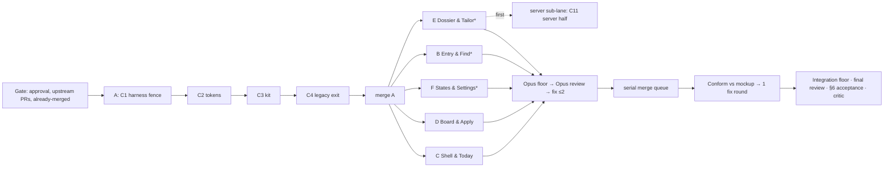

# UX01 Phase 3: build plan (dynamic workflow)

**Goal.** Build the parts of [SPEC.md](SPEC.md) Emilio approves so the running app matches [mockup.html](mockup.html). The work lands on the local branch `feat/ux-zero-to-one`.

**Success means:**
- Every change in the cut is merged, or listed as deferred or needing attention with a reason.
- Each lane passed the CI-parity floor and a diff review, each run by a fresh Opus 5.5 context that did not write the code.
- The integration floor is green.
- The SPEC §6 numbers have been re-measured against their targets.

**Stop when** either of these happens:
- Every lane that can run has merged and acceptance is measured.
- A wall is hit: a verifier cannot run, lane A fails, or quota runs out. The run then checkpoints, returns, and waits for Emilio.

The script is [`ux01-build.workflow.js`](ux01-build.workflow.js). It is only a plan until Emilio says go. Nothing in it pushes, opens a PR, or deploys.

## 1. How to run

```js
// 1. Dry run: gate only, prints the lane plan. Builds nothing.
Workflow({ scriptPath: "<worktree>/docs/programs/ux01-20260925/ux01-build.workflow.js",
           args: { approved: true, cut: ["C1", …], retireLegacyView: false, dryRun: true } })
// 2. Real run: the same args with dryRun removed.
// 3. Re-run whenever #104, #102 or casefit merges. Lanes already merged are skipped.
```

| arg | default | meaning |
|---|---|---|
| `approved` | required | Must be `true`. Without it the script returns before spawning anything. |
| `cut` | all of C1–C22 | The change ids Emilio approved. Lanes with nothing in the cut are skipped. |
| `retireLegacyView` | `false` | SPEC §2 step 3. When false, `?jb-v2=0` keeps working and lane A deletes only code that is dead in both views. |
| `solLane` | `true` | The server half of C11 (the backend drafts from the user's resume) runs as an Opus sub-lane on `feat/ux01-sol-server` before lane E. When false, only the UI gate ships. |
| `maxFixRounds` | `2` | Fix rounds allowed per lane before it is marked needs-attention. |

## 2. Shape


`*` marks lanes gated on upstream work: F waits on #104, B on #104 and #102, E on casefit. A gated lane is deferred with the reason and picked up on the next run.

## 3. Lanes

Each lane runs as opus at medium effort, in its own worktree `~/Job-Bored.worktrees/ux01-<slug>` on branch `feat/ux01-<slug>`, cut from `feat/ux-zero-to-one`. No two lanes own the same file.

| lane | changes | gate |
|---|---|---|
| A System | C1 → C2 → C3 → C4, strictly in that order. C1 comes first because the floor runs on the hermetic harness. | none; merges before any other lane starts |
| C Shell & Today | C5 (top-bar and empty states), C18, C20, plus TR-21 | A |
| D Board & Apply | C5 (URL-modal fallback), C15, C16 (API), C17, C19 | A |
| F States & Settings | C21, C22 | A, #104 |
| B Entry & Find | C6–C10 | A, #104, #102 |
| E Dossier & Tailor | C11–C14, C16 (prompt); the server sub-lane lands `server/` first | A, casefit |

**Deviations from SPEC §5.** C5's add-job fallback and `ingest-url-flow.js` move from B to D, so the P0 add-job fix doesn't wait on #104 and #102. The SPEC lane table is updated to match. C16 is split: D builds the API and E builds the prompt.

**Contracts between lanes.** Each is documented in the owning lane's report. Consumers feature-detect it and keep today's behaviour until it exists.

| contract | owner | consumers |
|---|---|---|
| `JobBoredIngest.openManual({url, title, company, location})` | D | C, B |
| `JobBoredSubmission.confirmApplied({dataIndex, prefill})` | D | E |
| `jb:data:loaded` and `jb:data:load-failed` events | F | C |
| Resume field in the materials request; `422 resume_required` | server sub-lane | E |

## 4. What makes it dynamic

- **Upstream gating.** The gate checks #104, #102 and casefit live. Ready lanes build now, and blocked lanes are deferred with a reason.
- **Idempotent re-runs.** Branches already merged into `feat/ux-zero-to-one` are skipped, so re-running after an upstream merge picks up exactly the deferred lanes.
- **Verification loop.**
  - A fresh Opus verifier runs the CI-parity floor: `lint:repo`, `typecheck:repo`, `npm test`, `test:contract:all`, `e2e-smoke`, `e2e-journey`, `e2e-visual`. The integration floor adds `test:coverage` and `test:browser-use-discovery`.
  - A fresh Opus reviewer reads the diff against the SPEC, the lane's owned files and the write-back contracts.
  - Red results feed a root-cause fix round, at most 2.
- **Walls, not skips.** If a verifier or reviewer cannot run, the lane is blocked and the run returns.
- **All Opus 5.5 (Emilio, 2026-09-25).** Every builder, verifier, reviewer and the server sub-lane runs Opus 5.5 at medium effort. Grok was out (402, balance exhausted) and the launch policy blocks Muse from an unsandboxed shell. Independence comes from a fresh context per verifier; the builder never checks its own work.
- **Merge queue.**
  - Merges into the base branch run one at a time, and each merge commits only if `lint:repo`, `typecheck:repo` and `e2e-smoke` pass.
  - On a conflict, the lane syncs with the base branch once, re-verifies, and retries the merge.
- **Conformance.** Three agents compare the built app with the mockup at 1440 and 375 for each C-tag. Must-fix gaps go back to the owning lane for one round.
- **Acceptance.**
  - Re-runs the Phase 1 scripts kept in `audit/tools/scripts/` to measure stylesheets, colours, font sizes, axe results and clicks to the first tracked job.
  - Runs a final Grok review of the whole integrated diff.
  - Runs a completeness critic that lists unaddressed finding ids and handoffs no lane picked up.

## 5. Guardrails built into every lane prompt

- Edit only the files the lane owns; anything else becomes a handoff.
- Use tokens only, with no raw colour literals. Scope each component under its root class to avoid the cascade trap.
- Keep the write-back contracts intact: `data-action`, `data-stable-key`, `expandedJobKeys`, `updateJobStatus`, and the pipeline-row schema.
- Write a failing test before each behaviour change. Set reduced motion with `page.emulateMedia` and assert `matchMedia`.
- Refresh a visual baseline only for an intended change, and record each refresh as a before/after pair.
- Never run the dev server, bind `:8080`, `:3847` or `:8644`, or click setup actions against the host.
- Commit to the lane branch only; never push. Paste the floor output into `lanes/LANE-REPORT-<lane>.md`.

## 6. Before launch (Emilio)

1. Approve the SPEC and name the cut.
2. Decide `retireLegacyView`.
3. The live `:8644` worker still runs from `~/Job-Bored.worktrees/ux01`. The workflow never removes that worktree, but restart the worker from `~/Job-Bored` when convenient.
4. Expected fan-out:
   - 4 lane A steps
   - up to 5 parallel lanes, plus the sol sub-lane
   - about 2 verifier runs per lane
   - 3 conformance agents and the acceptance set

   An all-ready simulation made about 44 agent calls, not counting fix rounds.

**Validated so far.** `node --check` passes. A stub run exercised the control flow: B deferred on #102, lane A ran in order, at most one merge at a time, a red floor triggered a fix round, and dry runs and unapproved runs stopped at the gate. **Not validated:** a live run of Muse, Grok or Codex through the script.

**Revised 2026-09-25 (all-Opus run).** Verifiers, reviewer and the server sub-lane moved to Opus 5.5 at medium effort; the floor gained `typecheck:repo`, `lint:skills` and the contract tests for CI parity; the sol check no longer calls the missing `npm --prefix server test`; the integration review diffs against `origin/main` rather than the empty `BASE...HEAD`; a lane counts as already merged only when its `merge(ux01): lane <id>` commit exists; the C1 builder gets a host-safety guard. A stub run passed eight scenarios: unapproved, bad cut, dry run, today's upstream state (A, C and D ready; about 32 agent calls), red floor on D, red floor on lane A's C2, everything unblocked (server sub-lane before E; 45 calls), and an idempotent re-run.
