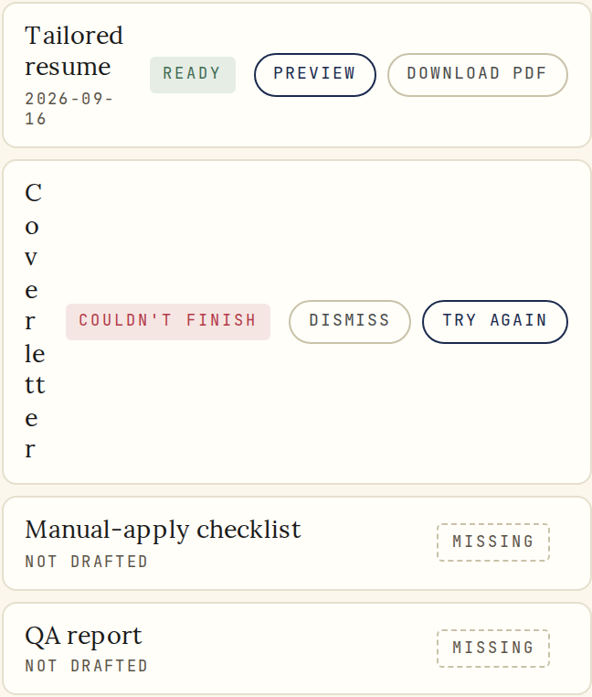
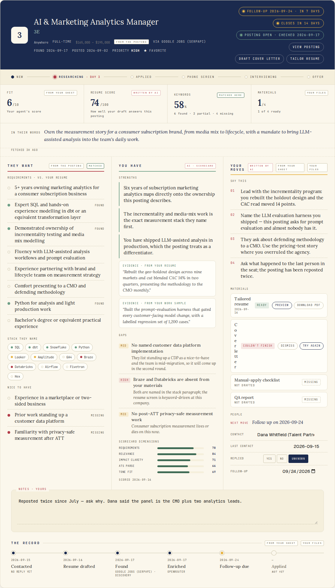
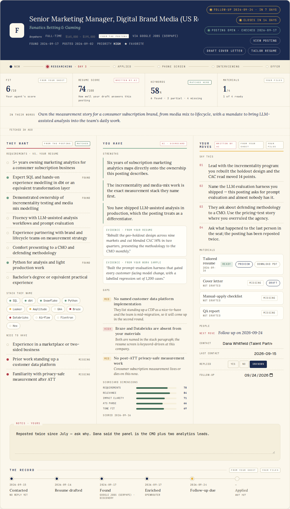
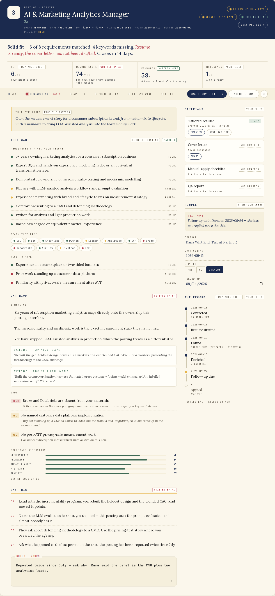
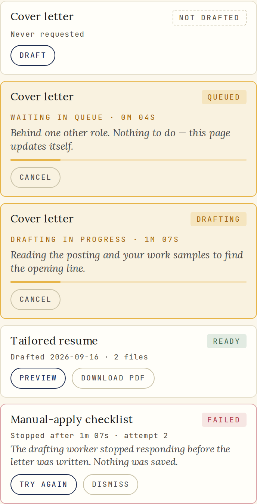
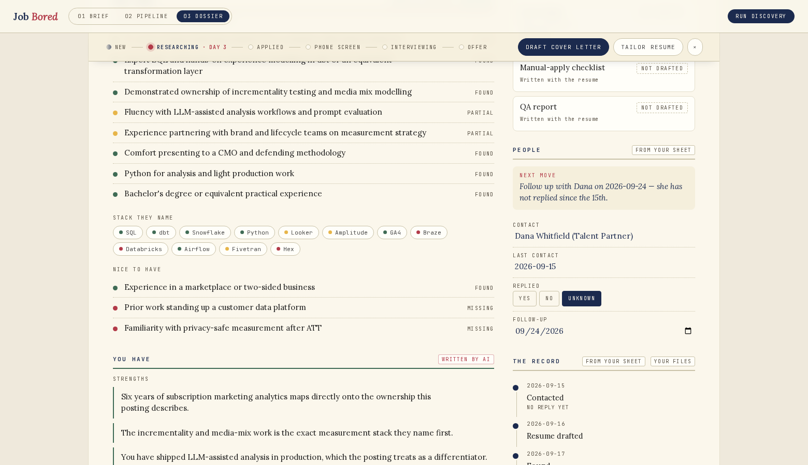

# Teardown: why the three-column dossier fails

**Date** 2026-09-17 · **Surface** `[data-region="role"] .case` (`role-case.js`, `role-case.css`)
**Every number below is measured**, not estimated. The probe in
[`audit/current-3col-probe.html`](audit/current-3col-probe.html) loads production CSS and calls the
production renderer; [`audit/measure.mjs`](audit/measure.mjs) walks every element inside `.case` at
1024 / 1280 / 1440 / 1512 and writes [`audit/RESULTS.json`](audit/RESULTS.json). Re-run with
`node docs/redesign/dossier-2026-09/audit/measure.mjs`.

---

## 1. The headline: it does not overflow. It crushes.

The dogfood report says "clipping all over," and that is exactly what it looks like. But the
measurement says something more specific and more useful:

| Check | Result at 1280 / 1440 / 1512 |
| --- | --- |
| Elements whose ink escapes the `.case` frame | **0** |
| Elements that overflow their own box with no scroller | **1** (a native date input, +15px) |
| Elements bleeding across a lane boundary | **0** |

Nothing overflows. There is no clipped ink, no hidden scrollbar, no ancestor cutting anything off.
And yet:



That is `.case__doc` for `cover_letter` in the failed state, at 1440. The measured row:

```
{"doc":"cover_letter","rowWidth":323.3,"nameColPx":12.3,"statusColPx":112,"actionsColPx":153.1,"labelLines":9}
```

The name column is **12.3 pixels wide** and the words "Cover letter" occupy **nine lines**. No
pixel left its box. The layout absorbed a 100px deficit by destroying the text instead.

**This is the whole bug.** The three-column board cannot overflow, because every escape route was
already sealed:

- `.case__board` uses `repeat(3, minmax(0, 1fr))` — a `0` floor means a track can shrink to any
  width at all, including 12px.
- `.case__lane` sets `min-width: 0`, so the lane never asserts a minimum either.
- `.case__doc-n` sets `overflow-wrap: anywhere`, which converts a horizontal deficit into vertical
  shredding rather than an overflow.

Each of those three is a *defensive* declaration. Individually they read as careful CSS: "don't let
grid blow out, don't let a long word escape." Together they guarantee that the layout always
reports success. The browser never overflows, so it never scrolls, never shows a scrollbar, and
never triggers any fallback — and the failure becomes invisible to every automated check while
being the most visible thing on the page to a human.

> A layout that cannot overflow cannot tell you it is too small. It can only get worse quietly.

---

## 2. Why the deficit exists: two `auto` tracks that cannot yield

`.case__doc` is `grid-template-columns: minmax(0, 1fr) auto auto` — name, status pill, buttons.

An `auto` track sizes to its content and, critically, **will not shrink below its min-content
width**. Both `auto` tracks here are made of `white-space: nowrap` text, so their min-content width
*is* their full width. In the failed state at 1440:

| Track | Width | Can it shrink? |
| --- | --- | --- |
| name (`minmax(0, 1fr)`) | **12.3px** | to zero |
| status pill — "couldn't finish", nowrap | 112px | no |
| actions — "Dismiss" + "Try again", nowrap | 153.1px | no |
| padding + gaps | 44px | no |
| **row total** | 323.3px | |

309 of the 323 available pixels are claimed by tracks that refuse to give any back. The name track
gets the remainder. It is not that the row was designed badly for its width — it is that the row
has no say in its width at all, and the one flexible track is the one carrying the only content the
user needs to identify the row.

The ready state is the same shape, less dramatic: "Preview" + "Download PDF" take 172.4px, the
`ready` pill 46.7px, and "Tailored resume" is left with 58.3px and wraps to two lines.

---

## 3. Why it happens at 1440 and not at 1024

This is the part that makes the bug feel arbitrary in dogfood, and it is the most important
structural finding.

`role-case.css` collapses the board to one column at `@media (max-width: 1080px)`. So:

| Viewport | Board | Lane text measure | Result |
| --- | --- | --- | --- |
| 1024px | 1 column | **912.5px** | correct; 0 findings |
| 1280px | 3 columns | **323.3px** | crushed |
| 1440px | 3 columns | **323.3px** | crushed |
| 1512px | 3 columns | **323.3px** | crushed |

**The shipped dossier is correct at the width nobody uses and broken at every width the brief names
(1280–1512+).**

The reason is that the media query asks the wrong question. `max-width: 1080px` is a fact about the
*window*. What the row needs to know is how wide its *lane* is — and the relationship between the
two is not what the breakpoint assumes. A 1080px window yields a lane of roughly 300px. So the rule
reads, in effect: "three columns whenever each column can be under 300px wide."

Worse, the relationship is not even monotonic in a useful way, because of §4.

---

## 4. The frame is 104px narrower than every other region, and nobody noticed

Measured at 1440:

```
"caseWidth": 1116,          the dossier frame
"siblingRegionWidth": 1220,  what --jb-flow-content-width yields at top level
"unusedViewportPx": 324
```

`.case` is sized with `width: min(var(--jb-flow-content-width, 1240px), 100%)`. The token is:

```css
--jb-flow-content-width: min(1220px, calc(100% - clamp(16px,3vw,32px) - clamp(16px,3vw,32px)));
```

That `100%` is a percentage inside a custom property, so it resolves **at the point of use**, against
the element's own containing block. Every other region (`pipeline`, `dawn`, `today`, `lattice`)
applies the token to a top-level section, where `100%` is the page and the subtraction produces the
intended shell gutter. The dossier applies it to `.case`, nested inside `.dossier` (`max-width:
1180px`) inside `.brief`. So `100%` is 1180, and the 32px gutter is subtracted **a second time**:

```
1180 − 32 − 32 = 1116
```

Three consequences, all of them paid by the lanes:

1. The dossier is 104px narrower than the pipeline directly above it — a visible misalignment
   between two stacked regions in the same flow.
2. Those 104px are divided by three: **every lane is ~35px narrower than intended**, about 11% of a
   323px text measure, which is exactly the margin between "tight" and "shredded."
3. There are three different maxima in play for one surface — `.case` says 1240, `.dossier` says
   1180, the flow says 1220 — and none of them is what renders.

Meanwhile **324px of a 1440px viewport is unused**. The layout is starving three columns while
leaving a fifth of the screen empty.

---

## 5. `overflow: hidden` on the frame forecloses the fix

`.case` sets `overflow: hidden` (to clip the 14px radius). That has a second effect nobody wanted:
**it makes the frame a scroll container**, which means `position: sticky` on any descendant sticks
to a box that never scrolls — i.e. does nothing.

So the dossier cannot have a persistent action bar. The "Draft cover letter" and "Tailor resume"
buttons live in the masthead and scroll away after ~200px. On the fixture role the frame is
1,956px tall and the masthead that holds those buttons is the top 230px of it — so for 88% of the
scroll depth there is no way to request materials without scrolling back to the top. The one property added for a rounded corner is the reason the primary
action is unreachable.

---

## 6. Hierarchy: three lanes, no lede, no primary



Beyond the geometry, the board makes three editorial mistakes.

**There is no verdict.** The dossier opens with identity, then a stage stepper, then four number
tiles, then a quote — and then asks the reader to synthesise "how am I doing on this role, and what
should I do next" by reading three columns and comparing them. The single most valuable sentence in
the dossier is the one it never writes.

**All three lanes have identical weight.** `THEY WANT`, `YOU HAVE`, `YOUR MOVES` are the same
11px mono uppercase with the same 2px coloured rule. Nothing is primary. The eye has no entry point
and picks the leftmost column by default — which is the reference material, not the task.

**The action column is last in the scan path and shares vertical space with the longest column.**
The reader's actual job — request materials, log a contact, set a follow-up — is in column three,
whose height is set by grid stretch to match the tallest lane. Measured lane ink heights at 1440:
953.6 / 1081.7 / 1067.5px in a row that is 1107.7px tall. So a dotted lane rule runs through 154px
of empty space, the columns end raggedly, and the shortest lane's tail is dead area.

**Three columns break the one comparison that matters.** "They want" and "You have" are a pair: a
requirement and whether you answer it. Splitting them into adjacent columns separated by a 1px rule
and 48px of padding means the reader saccades horizontally between two independently-scrolling
lists to make one judgement, and the vertical positions never correspond.

---

## 7. Smaller faults the same audit surfaced

- **The role title is silently truncated.** `.case__title` is an `<input>` with `width: 100%`.
  With the real posting title *Senior Marketing Manager, Digital Brand Media (US Remote)*: measured
  `truncatedPx: 81` — 81 pixels of the title are unreachable, with no ellipsis and no wrap.
  
- **The contact name is truncated the same way.** `.case__v--edit` is `width: 60%` beside a nowrap
  label, so "Dana Whitfield (Talent Partner)" renders as "Dana Whitfield (Talent Partn".
- **The type is too small to read.** 23 of the 51 `font-size` declarations in `role-case.css` are
  below 10px, and 21 of those are below 9.5px — including a 7.5px provenance chip and 8px eyebrows — all uppercase
  and tracked at 0.16–0.22em, which is the least legible combination available.
- **`data-action="close-role"` is wired in `role.js` and never rendered.** The dossier has no close
  control at all.
- **`.case__events` divides a fixed width by a data-driven N.** `grid-auto-flow: column` with
  `grid-auto-columns: minmax(0, 1fr)` gives each event `1042/N` px. Today N tops out around 7
  (173.7px each at N=6, with 2-line labels), so this is latent rather than broken — but it is the same
  no-floor pattern as §2, waiting for the event list to grow.
- **Materials state has two homes that do not agree.** The Materials Queue overlay reports
  `LETTER FAILED 1m 07s` in the corner while the authoritative row sits shredded two-thirds of the
  way across the page. In the dogfood screenshot both are on screen simultaneously.

---

## 8. Why the proposed layout wins

The replacement is a **reading canvas plus a bounded ledger, under a sticky docket**. Full rules in
[`SPEC.md`](SPEC.md); mocks in [`mocks/`](mocks/).



Point by point against the teardown above:

**§1–2, the crush.** Two structural rules make it unrepresentable. `minmax(0, 1fr)` is banned as a
track for content-bearing columns; every track names a floor in `rem`. And the materials row stops
putting the label and the buttons on the same line: it is two rows of two areas
(`"name state" / "meta" / "acts"`), so no `auto` track can ever take the name's width. Measured at
the real 352px ledger width, in the same failed state, the name column is **251.6px** rather than
12.3px, and every state
reads as a sentence:



**§3, the wrong breakpoint.** Every threshold is a **container query** on the dossier frame. The
two-column layout requires `inline-size >= 62rem`, which is exactly `34rem` (canvas floor) +
`20rem` (ledger floor) + `2.75rem` (widest gap) + `4.5rem` (the frame's own gutter, twice). The
layout can therefore never be in a state where a track is narrower than its contents were designed
for: either both floors fit, or there is one column. That is a guarantee; `repeat(3, minmax(0,
1fr))` is a hope.

That sum was wrong in the first draft of this proposal — it omitted the gutter, which would have
produced a two-column grid overflowing its own padding box between 912 and 992px. It was caught by
the check described below, which is the argument for having the check.

**§4, the frame.** The frame is `min(1220px, 100%)` with no nested percentage, so it matches the
pipeline above it, and surplus width past the two track maxima becomes margin
(`justify-content: center`) rather than longer lines of text. Measured: frame 1220, canvas 736,
ledger 352 at both 1440 and 1280.

**§5, sticky.** No `overflow: hidden` anywhere on an ancestor of content; the radius comes from
`clip-path`, which clips without creating a scrollport. The docket therefore sticks, and stage,
the drafting actions and the live in-flight run stay under the app chrome at any scroll depth:



**§6, hierarchy.** One derived sentence opens the dossier — *"Solid fit — 6 of 8 requirements
matched, 4 keywords missing. Resume is ready; the cover letter has not been drafted. Closes in 14
days."* — assembled from data the model already carries (SPEC §4). "They want" and "You have" are
now stacked in the same column at the same measure, so the comparison is vertical and adjacent
instead of horizontal and misaligned. And the sticky docket, not a column, is what carries the
action — so the task is never at the end of the scan path.

**§7, the details.** The title is wrapping text with an edit mode rather than a truncating input;
ledger values sit under their labels so a 31-character contact name fits; a `--dsr-label: 10px`
floor governs every mono label; `close-role` is rendered in the docket; the record is a vertical
timeline of one row per event, so N no longer divides a fixed width; and the in-flight materials run
is mirrored into the docket, so the overlay is never the only place the state is legible.

**The check that matters.** [`audit/shoot-mocks.mjs`](audit/shoot-mocks.mjs) runs the same audit
against the mocks — plus a shredding detector that flags any label breaking mid-word, and a check
that the two column tracks plus the gap fit the body's content box — at 1560, 1400, 1100, 1000, 800
and 470px viewports. Current result: **clean at every audited width**
([`audit/MOCK-AUDIT.json`](audit/MOCK-AUDIT.json)).

It has already caught two real bugs in the proposal: the metric tile key row overflowed by up to
35px at 348px until it was allowed to wrap, and the column threshold was 5rem too low because it did
not account for the frame's gutter. Both are the sort of thing that ships otherwise, which is the
point of having it.

---

## 9. What this argues against

For completeness, the two layouts that were considered and rejected:

**Keep three columns and add container queries.** This fixes §3 and §1 mechanically — with floors
and container queries you can make three columns degrade honestly. It does not fix §6: three
equal-weight columns still have no primary, still split the "they want / you have" comparison, and
still put the action last. Three bounded columns need `3 × 20rem + gaps ≈ 66rem` of frame to exist
at all, so on a 1280px laptop they would collapse to one column anyway — meaning the three-column
layout would essentially never render for the people who reported the bug.

**Tabs (Read / Match / Act / Record).** Removes all width pressure and is the cheapest thing to
build. Rejected because the dossier's value is the synthesis: a hunter wants a requirement and their
gap against it in one view, and wants to see that the resume is ready while reading the posting.
Tabs turn one judgement into three navigations, and hide state that should be ambient.
