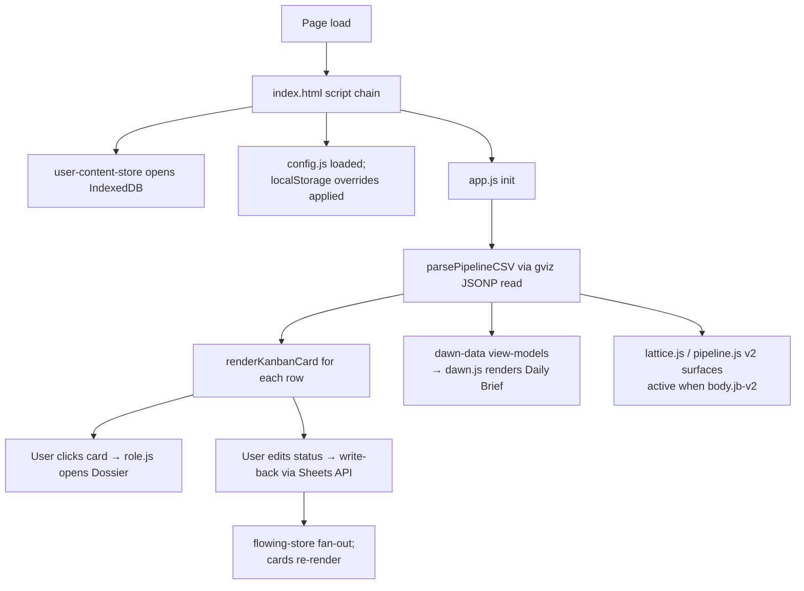

# Dashboard

Active contributors: emilio3435

## Purpose

The static dashboard is the always-present surface of JobBored. It renders Pipeline rows from a user-owned Google Sheet, lets the user write back stage / notes / replies, runs the Daily Brief, and dispatches discovery webhook calls. Everything ships in `index.html` plus ~50 root JS files and ~18 CSS files — no build step.

## Directory layout

```
.
├── index.html                  # Composition point; orders all <script>/<link> tags
├── config.example.js           # Template config (copy to config.js)
├── config.js                   # Runtime config (gitignored)
├── style.css                   # Legacy v1 styles (~13k LOC)
├── tokens-v2.css / jb-v2.css   # v2 design tokens
├── app.js                      # Main controller (~24k LOC)
├── dawn.js / dawn-data.js      # Daily Brief surface
├── pipeline.js                 # v2 horizontal sticker board
├── lattice.js                  # v2 kanban
├── role.js / role-brief.js / role-materials.js  # v2 Dossier
├── letter.js / scribe.js       # ATS + cover-letter (Phase 3)
├── flowing-chrome.js / flowing-store.js / flowing-writes.js
├── welcome.js                  # Onboarding
├── jb-ui.js                    # Custom elements (<jb-fit-ring>, <jb-spark>)
├── settings-*.js               # Settings tabs schema + behavior
├── discovery-wizard-*.js       # Discovery drawer wizard
├── resume-*.js / fit-profile-*.js / document-templates.js / visual-themes.js
├── runs-tab.js / companies-tab.js
├── user-content-store.js       # IndexedDB
├── dev-server.mjs              # Local dev server
└── ...
```

## Key abstractions

| Module | File | Role |
| --- | --- | --- |
| Main controller | `app.js` | OAuth state, sheet read/write, card render, filters, discovery dispatch, async polling |
| Pipeline CSV parser | `app.js:12340` (`parsePipelineCSV`) | CSV → in-memory rows; column indices live here |
| Card actions | `app.js:13699` (`renderCardActions`) | Status/priority dropdowns; authoritative enum source |
| Sign in | `app.js:8832` (`signIn`) | Google Identity Services token flow |
| Discovery dispatch | `app.js:10248` (`triggerDiscoveryRun`) | Builds `command-center.discovery` POST + async polling |
| User content store | `user-content-store.js` | IndexedDB: resumes, samples, preferences, drafts |
| v2 store | `flowing-store.js` | Cross-surface shared store under `body.jb-v2` |
| v2 write-back bridge | `flowing-writes.js` | Listens to `jb:role:writeback`, writes Sheet cells |
| Custom elements | `jb-ui.js` | `<jb-fit-ring percent>`, `<jb-spark data>` |
| Discovery wizard | `discovery-wizard-{local,relay,probes,verify,shell}.js` | Drawer wizard for worker / tunnel / relay setup |
| Setup doctor | `setup-doctor.js` | One-click self-heal for greenfield onboarding |

## How it works



### Read path

`app.js` first tries the public `gviz` JSONP endpoint. This works without OAuth as long as the sheet is published or "anyone with the link" shared. When the user is signed in, the same fetch falls back to `spreadsheets.values.get` via the Sheets API.

`parsePipelineCSV` walks the rows and yields normalized job objects. Column letters → field names are hard-coded against `schemas/pipeline-row.v1.json`. The schema's `sheetIndex` values determine the parsing offsets.

### Write path

When the user changes status, notes, follow-up, applied date, last contact, or reply flag, `app.js` builds a `spreadsheets.values.batchUpdate` request and sends it with the in-memory GIS access token. There is no server-side write proxy.

`flowing-writes.js` does the same job for the v2 Dossier — it listens for `jb:role:writeback` (`field` ∈ `stage | heardBack | reply | followupAt | passed`) and translates to Sheet cell writes.

### Discovery dispatch

`triggerDiscoveryRun` (`app.js:10248`) builds the payload from `discovery-payload.js` (the shared builder used by tests too), POSTs to the configured webhook URL, and handles three response shapes:

- Sync `200` — refresh on the next poll
- Async `{ ok: true, kind: "accepted_async", runId, statusPath, pollAfterMs }` — start a status poll against `statusPath`
- Failure — surface a toast

`statusPath` is opaque (it carries a `statusToken` query parameter for hosted workers). The dashboard preserves it verbatim. Polling tolerates both `statusPath` and `status_path`.

### v2 surfaces

`body.jb-v2` is the global gate. URL `?jb-v2=1|0` wins and persists; otherwise `localStorage` `jb-v2-flag` decides. When v2 is on, `flowing-chrome.js` builds sticky top chrome, `pipeline.js` / `lattice.js` render the redesigned pipeline, and `role.js` opens the Dossier on card click. The legacy surfaces stay in the DOM but get hidden by `jb-v2-legacy-hide.css`.

## Integration points

- **Google Sheets** — read via `gviz` JSONP; write via Sheets API v4. OAuth state lives in `app.js`.
- **Google Identity Services** — loaded from `accounts.google.com/gsi/client`.
- **Scraper server** (`server/index.mjs`) — called from Fetch posting and ATS scorecard flows. See [Scraper server](scraper-server.md).
- **Discovery worker** — POST target for `triggerDiscoveryRun`. See [Discovery worker](discovery-worker/index.md).
- **IndexedDB** (`user-content-store.js`) — resumes, samples, preferences, generated drafts.
- **localStorage** — overrides for sheet ID, OAuth client ID, webhook URL, BYO LLM keys, schedule cadence.

## Entry points for modification

- Adding a column to Pipeline → update `schemas/pipeline-row.v1.json`, `parsePipelineCSV` in `app.js`, README "Sheet Structure", and `AGENT_CONTRACT.md`. Then run `npm run test:pipeline-contract`.
- Adding a card action → extend `renderCardActions` (`app.js:13699`) and the matching write-back path.
- New v2 surface → drop a `surface.js` + `surface.css` under root, add `<script defer>` in `index.html`, mount under `[data-region="..."]`, and follow `body.jb-v2` gating like the existing surfaces.
- Discovery payload field → add it to `discovery-payload.js` so the browser + tests + scripts agree, then bump the JSON Schema if it's a contract change.

## Tests

Browser surface tests live in `tests/*.test.mjs` and run with Node's built-in test runner (jsdom-style assertions against pure JS). Key examples:

- `tests/dossier-card-attrs.test.mjs` — `data-*` invariants
- `tests/runs-tab.test.mjs` — `DiscoveryRuns` rendering
- `tests/pipeline-filter-controls.test.mjs` — stage / priority filters
- `tests/dawn-data-lead-stories.test.mjs` — Daily Brief view-model

## Related

- [Dev server](dev-server.md) — what serves the dashboard locally
- [Pipeline feature](../features/pipeline.md) — sticker board, dossier, write-back
- [Discovery feature](../features/discovery.md) — Run discovery + wizard
- [Settings feature](../features/settings.md) — tabs, IDs, BYO keys
- [Glossary](../overview/glossary.md) — themed module names
