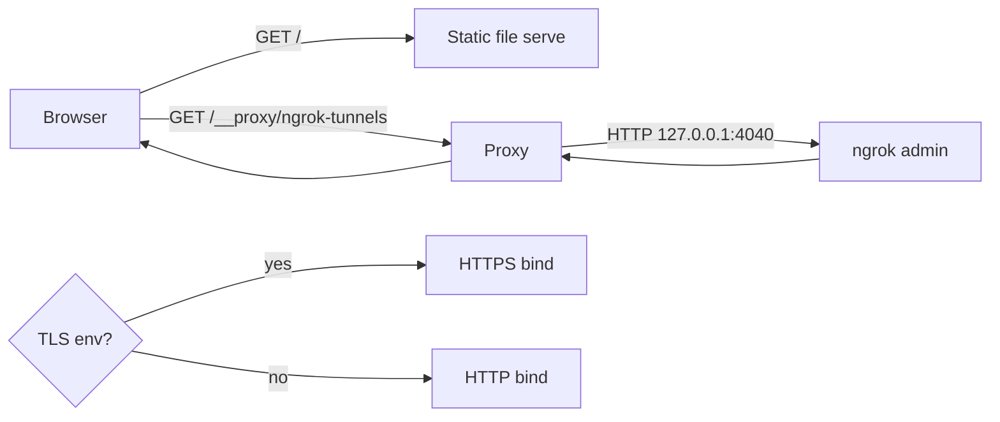

# Dev server

Active contributors: emilio3435

## Purpose

`dev-server.mjs` is the local file server that powers `npm run web-only`, `npm start`, and `npm run dev`. It serves static files, proxies the ngrok admin API, can optionally generate self-signed TLS, and (when run as part of `npm run dev`) supervises the discovery worker auto-start.

## Directory layout

- `dev-server.mjs` — the server itself (~1900 LOC)
- `scripts/lib/paths.mjs` — `resolveJobBoredPaths` helper for `~/.jobbored/...` defaults

## Key abstractions

| Symbol | Purpose |
| --- | --- |
| `DEFAULT_PORT = 8080` | Default bind port |
| `MIME` map | Static file MIME types (HTML, CSS, JS, fonts, images, manifest) |
| `PROXY_ROUTES` | `/__proxy/ngrok-tunnels` → `127.0.0.1:4040/api/tunnels` (the dashboard polls ngrok admin to detect tunnel rotations) |
| `TLS_CERT_PATH` / `TLS_KEY_PATH` | Cached self-signed cert under `node_modules/.cache/command-center-dev-server/` |
| `DISCOVERY_WORKER_*` constants | Defaults the dev server uses when spawning the local discovery worker (port `8644`, script `integrations/browser-use-discovery/src/server.ts`, config path `~/.jobbored/...`) |
| `EXPECTED_DISCOVERY_WORKER_SERVICE` | `"browser-use-discovery-worker"` — used by autostart status checks |

## How it works

The default flow is plain static serving with two extras:

1. **ngrok admin proxy** — the dashboard's discovery wizard hits `/__proxy/ngrok-tunnels` to enumerate the current ngrok tunnels and detect rotations. This is server-side because browsers can't reach `127.0.0.1:4040` over HTTPS on GitHub Pages.
2. **TLS toggle** — `COMMAND_CENTER_TLS=1` makes the server generate a self-signed cert (via `openssl`) and bind HTTPS. The cert is reused across runs.

The `npm run dev` script wires `dev-server.mjs` together with `npm run start:scraper` and `npm run start:discovery-worker` via `concurrently`. Each runs in its own process and dies together.

## Integration points

- `scripts/lib/paths.mjs` — the dev server resolves `~/.jobbored/...` defaults through this shared helper so the discovery worker, the bootstrap script, and the dev server agree on where state lives.
- `dev-server.mjs` is imported by no other code; it's a CLI entry point with `node dev-server.mjs`.

## Entry points for modification

- Adding a new server-side proxy → extend `PROXY_ROUTES` near the top of `dev-server.mjs`.
- Changing the default port → update `DEFAULT_PORT` and the corresponding `npm` scripts that mention `8080`.
- Skip TLS regen → delete the cached cert under `node_modules/.cache/command-center-dev-server/` then restart with `COMMAND_CENTER_TLS=1`.

## Related

- [Dashboard](dashboard.md) — the artifact the dev server serves
- [Configuration](../reference/configuration.md) — full env var matrix
- [Discovery worker](discovery-worker/index.md) — what the dev server can supervise
