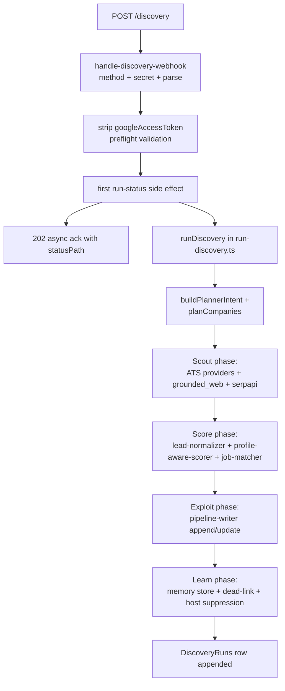

# Discovery worker

Active contributors: emilio3435

## Purpose

`integrations/browser-use-discovery/` is the bundled user-owned discovery worker. It accepts the `command-center.discovery` webhook, runs a scout → score → exploit → learn loop across ATS providers, Gemini-grounded web search, and SerpApi Google Jobs, normalizes leads, dedupes against the Pipeline sheet, and writes new rows back. It runs in two modes: `local` (default, on the user's laptop, `127.0.0.1:8644`) and `hosted` (server deployment with per-run `googleAccessToken` from the dashboard).

This is the largest TypeScript surface in the repo (~36k LOC across `src/`).

## Sub-pages

| Page | Scope |
| --- | --- |
| [HTTP server](http-server.md) | Routes (`/health`, `/discovery`, `/runs/:runId`, `/discovery-profile`, `/ingest-url`, `/cleanup-expired`), method/auth/order invariants |
| [Run loop](run-loop.md) | `run-discovery.ts` scout / score / exploit / learn, frontier scorer, budget tracker |
| [Source lanes](source-lanes.md) | ATS providers, grounded web (Gemini + Browser Use), SerpApi Google Jobs, ingest-url router |
| [State and memory](state-and-memory.md) | SQLite memory store, run-status store, listing-score cache, dead-link tracking |
| [Sheets writer](sheets-writer.md) | Pipeline writer, dedupe, optional column upgrades, DiscoveryRuns logger, Blacklist tab |

## Directory layout

```
integrations/browser-use-discovery/
├── src/
│   ├── server.ts                 # HTTP entry (~1.4k LOC)
│   ├── config.ts                 # Runtime + worker-config + preset resolution (~1.3k LOC)
│   ├── contracts.ts              # Webhook contract, source IDs, types (~1.5k LOC)
│   ├── webhook/
│   │   ├── handle-discovery-webhook.ts
│   │   ├── handle-discovery-profile.ts
│   │   ├── handle-cleanup-webhook.ts
│   │   ├── handle-ingest-url.ts
│   │   ├── run-status-auth.ts
│   ├── run/
│   │   ├── run-discovery.ts      # Scout/score/exploit/learn (~2.6k LOC)
│   │   ├── frontier-scorer.ts
│   │   ├── budget-tracker.ts
│   ├── discovery/
│   │   ├── company-planner.ts    # Per-run company plan
│   │   ├── career-surface-resolver.ts
│   │   ├── directional-prompting.ts
│   │   ├── listing-fingerprint.ts
│   │   ├── profile-to-companies.ts
│   │   ├── company-keys.ts
│   ├── browser/
│   │   ├── session.ts            # BrowserUseSessionManager
│   │   ├── source-adapters.ts    # Registry + factory
│   │   ├── runtime-readiness.ts
│   │   ├── providers/            # Per-ATS adapters
│   │   └── selectors/
│   ├── grounding/
│   │   └── grounded-search.ts    # Gemini grounded + Browser Use extract (~3.7k LOC)
│   ├── sources/
│   │   ├── ats-public-fetchers.ts
│   │   ├── browser-use-cloud-extractor.ts
│   │   ├── serpapi-google-jobs.ts
│   │   ├── host-signatures.ts
│   │   ├── ingest-url-router.ts
│   ├── normalize/
│   │   ├── lead-normalizer.ts
│   │   ├── profile-aware-scorer.ts
│   │   ├── raw-to-single-lead.ts
│   ├── match/
│   │   └── job-matcher.ts        # AI matcher gate
│   ├── profile/
│   │   └── load-user-profile.ts
│   ├── sheets/
│   │   ├── pipeline-writer.ts
│   │   ├── discovery-runs-writer.ts
│   │   └── credential-readiness.ts
│   ├── state/
│   │   ├── discovery-memory-store.ts  # SQLite
│   │   ├── run-discovery-memory-store.ts
│   │   ├── run-status-store.ts
│   │   └── listing-score-cache.ts
│   ├── http/
│   │   └── origin-guard.ts
│   ├── cleanup/
│   │   └── expired-job-cleanup.ts
│   ├── contracts/
│   │   ├── user-profile.schema.json
│   │   └── user-profile.ts
│   └── index.ts                  # Re-exports for consumers
├── tests/
├── bin/
│   └── browser-use-agent-browser.mjs  # Bundled CLI wrapper
├── state/                         # Local SQLite + logs
├── package.json
└── README.md
```

## Top-level entry points

| Symbol | File | Purpose |
| --- | --- | --- |
| `createServer` | `integrations/browser-use-discovery/src/server.ts` | Wires runtime config, session manager, source registry, planners, memory store, run-status store, sheets writer |
| `handleDiscoveryWebhook` | `integrations/browser-use-discovery/src/webhook/handle-discovery-webhook.ts` | Contract validation, ack, sync/async dispatch (~1.4k LOC) |
| `runDiscovery` | `integrations/browser-use-discovery/src/run/run-discovery.ts` | The shared run pipeline for manual + scheduled discovery |
| `loadRuntimeConfig` | `integrations/browser-use-discovery/src/config.ts` | Merges env, worker-config JSON, per-request `googleAccessToken` |
| `createBrowserUseSessionManager` | `integrations/browser-use-discovery/src/browser/session.ts` | Manages Browser Use sessions (cloud or local CLI) |
| `createGroundedSearchClient` | `integrations/browser-use-discovery/src/grounding/grounded-search.ts` | Gemini Google Search grounding for company-by-company expansion |
| `createGeminiMatchClient` | `integrations/browser-use-discovery/src/match/job-matcher.ts` | LLM matcher gate for normalized leads |
| `createPipelineWriter` | `integrations/browser-use-discovery/src/sheets/pipeline-writer.ts` | Append/update Pipeline rows with Link-based dedupe |
| `createDiscoveryRunStatusStore` | `integrations/browser-use-discovery/src/state/run-status-store.ts` | In-memory run status with persistence, served at `/runs/:runId` |

## How it works



The security/order invariant in `handle-discovery-webhook.ts` is non-negotiable: method → secret → parse → strip token → validate → first status side effect → execute. Tests in `integrations/browser-use-discovery/tests/webhook/` enforce it.

## Integration points

- **Dashboard** — POSTs `command-center.discovery` to `/discovery`, polls `/runs/:runId`.
- **Google Sheets** — credentials resolved at request time in this precedence order (`src/config.ts`):
  1. `googleAccessToken` in the request body (per-request, never persisted)
  2. `BROWSER_USE_DISCOVERY_GOOGLE_ACCESS_TOKEN`
  3. Service account (`..._SERVICE_ACCOUNT_JSON` / `_FILE`) — recommended for unattended cron
  4. OAuth token (`..._OAUTH_TOKEN_JSON` / `_FILE`)
- **Gemini** — `BROWSER_USE_DISCOVERY_GEMINI_API_KEY`, default model `gemini-3.5-flash`.
- **Browser Use** — `BROWSER_USE_API_KEY` + `BROWSER_USE_PROFILE_ID` for cloud, or the bundled CLI wrapper at `integrations/browser-use-discovery/bin/browser-use-agent-browser.mjs` falling back to plain `browser-use` falling back to direct fetch.
- **SerpApi** — `SERPAPI_API_KEY` (also accepted as `BROWSER_USE_DISCOVERY_SERPAPI_API_KEY`, `DISCOVERY_SERPAPI_API_KEY`). Lane skips silently when unset.
- **SQLite** — memory store at `BROWSER_USE_DISCOVERY_STATE_DB_PATH` (defaults under `~/.jobbored/browser-use-discovery/state/`).
- **Hermes** — reads the same Pipeline + DiscoveryRuns tabs the worker writes.
- **Cloudflare relay** — `templates/cloudflare-worker/` and `integrations/cloudflare-relay-template/` proxy `/discovery` + `/runs` to the worker so browsers can call it through HTTPS even when the worker lives behind an ngrok tunnel.

## Entry points for modification

- New ATS provider → add `src/browser/providers/<name>.ts`, register in `src/browser/source-adapters.ts`, append the id to `ATS_SOURCE_IDS` in `src/contracts.ts`.
- New non-ATS source lane → add `src/sources/<name>.ts`, integrate in `runDiscovery` scout phase, add the id to `SUPPORTED_SOURCE_IDS`.
- Tighten scoring → change `profile-aware-scorer.ts` or `frontier-scorer.ts`. Both have dedicated tests.
- Webhook field → update `src/contracts.ts`, `schemas/discovery-webhook-request.v1.schema.json`, `examples/`, `AGENT_CONTRACT.md`, `docs/CONTRACT-CHANGELOG.md`. Run `npm run test:contract`.

## Tests

The worker has its own test tree at `integrations/browser-use-discovery/tests/{webhook,run,sources,sheets,state,browser,discovery,e2e}/`. Run all of them with `npm run test:browser-use-discovery`, or one file with `node --experimental-strip-types --test <path>`.

## Related

- [HTTP server sub-page](http-server.md) — full route table
- [Run loop sub-page](run-loop.md) — phase-by-phase walkthrough
- [Source lanes sub-page](source-lanes.md) — provider details
- [State and memory sub-page](state-and-memory.md) — SQLite schema
- [Sheets writer sub-page](sheets-writer.md) — dedupe + Blacklist
- [Discovery feature](../../features/discovery.md) — browser-facing surface
- [Discovery webhook contract](../../api/discovery-webhook.md)
