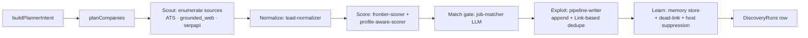

# Discovery worker · Run loop

`integrations/browser-use-discovery/src/run/run-discovery.ts` (~2.6k LOC) is the scout → score → exploit → learn pipeline. It is shared by manual runs (`POST /discovery`), scheduled runs (Apps Script / cron), and ingest-url single-row runs.

## Phases

### 1. Plan

`company-planner.ts` builds a list of candidate companies for this run. Inputs:

- The user's `discoveryProfile` (titles, locations, comp range, must-haves)
- Memory store (recent wins, hosts the user blacklisted, recently-suppressed companies)
- `sourcePreset` (`browser_only` / `ats_only` / `browser_plus_ats`)

Output: a deterministic ordered list of `companyKey` plans. `directional-prompting.ts` turns the plan into Goal/Success/Stop prompts when grounded-web search is involved.

### 2. Scout

For each company plan, the loop fans out to the enabled source lanes:

- `ats_*` — `ats-public-fetchers.ts` calls Greenhouse / Lever / Ashby / Workday / etc. without a browser.
- `grounded_web` — Gemini grounded Google Search returns candidate URLs; Browser Use extracts the JD.
- `serpapi_google_jobs` — single-shot listing search via SerpApi.

`career-surface-resolver.ts` classifies every URL produced. Third-party boards (LinkedIn, Indeed) are **hint-only** and never become direct write sources.

### 3. Normalize

`lead-normalizer.ts` standardizes the raw scout output into the shape the rest of the pipeline expects (company, title, location, comp range, work type, URL, source, postedAt). `listing-fingerprint.ts` builds a stable fingerprint used for in-run dedupe.

### 4. Score

Two scorers operate in tandem:

- `frontier-scorer.ts` — coarse re-rank for the entire frontier; promotes leads whose fingerprint differs most from things already in memory.
- `profile-aware-scorer.ts` — per-lead match: comp, location, role family, must-have keywords. Produces the `fitScore` written to the sheet.

`listing-score-cache.ts` caches scores so subsequent runs don't re-LLM identical fingerprints.

### 5. Match gate

`job-matcher.ts` is the final LLM gate. It returns `accept` / `reject` with reasoning. Rejected leads are still recorded in memory so the same URL doesn't get re-scored next run.

### 6. Exploit

`pipeline-writer.ts` appends or updates the Pipeline row, deduping by job URL. Updates can include the `OPTIONAL_PIPELINE_COLUMNS` (e.g., `Source`, `Source URL`, `Posted At`, `Fit Score`, `Match Reasoning`) when the user's sheet has them.

### 7. Learn

`run-discovery-memory-store.ts` (SQLite) records:

- Company / surface success counts → next run prioritizes producers
- Dead-link tracking → repeated 404s mark a surface dead
- Host suppression → repeated low-fit hosts suppressed for N runs
- Pre-filter reasons → surfaced in the dashboard's "Pre-filter" UI

The DiscoveryRuns row is appended with `discovery-runs-writer.ts`.

## Budget tracker

`budget-tracker.ts` caps total LLM tokens, Browser Use sessions, and elapsed wall-clock per run. The webhook can override defaults via `runtime.maxBudget` overrides; see `src/config.ts`.

## Failure handling

Every phase is wrapped in a try/catch. Errors are recorded in the run-status store with the phase name; the run still completes (with `status: "completed_with_errors"`) so the dashboard always sees a terminal state.

## Tests

- `tests/run/run-discovery-*.test.ts` — phase-by-phase
- `tests/run/frontier-scorer.test.ts`
- `tests/run/budget-tracker.test.ts`
- `tests/normalize/lead-normalizer.test.ts`
- `tests/match/job-matcher.test.ts`

## Related

- [Source lanes](source-lanes.md)
- [State and memory](state-and-memory.md)
- [Sheets writer](sheets-writer.md)
