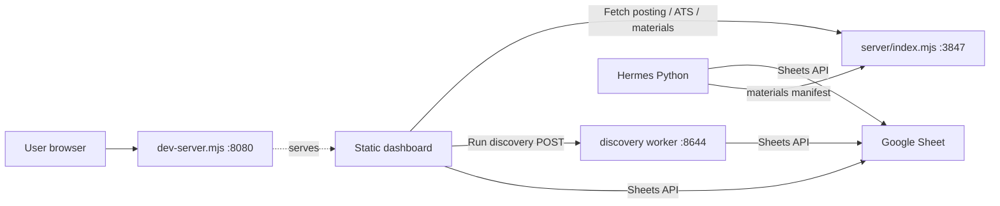

# Apps

The repo ships one primary deployable (the static dashboard) and several optional Node / Python runtimes. None is required to use the others. The dashboard is the only piece you must deploy; everything else is opt-in.

| App | Runtime | Default port | Required? |
| --- | --- | --- | --- |
| [Static dashboard](dashboard.md) | Vanilla JS in a browser | served at `:8080` by `dev-server.mjs` | yes |
| [Dev server](dev-server.md) | Node 24 (`dev-server.mjs`) | `:8080` | for local dev only |
| [Scraper server](scraper-server.md) | Node 24 Express (`server/index.mjs`) | `:3847` | optional (Fetch posting, ATS, materials) |
| [Discovery worker](discovery-worker/index.md) | Node 24 TypeScript (`integrations/browser-use-discovery/src/server.ts`) | `:8644` | optional (Run discovery) |
| [Hermes JHOS](hermes.md) | Python 3 (`~/.hermes/job-hunt/.venv`) | n/a (CLI/scheduler) | optional (materials drafting) |

`npm start` runs the first three together via `concurrently`. `npm run dev` adds the discovery worker. The dashboard is happy if any of the optional services are absent — it shows a connection-status indicator instead of blocking.

## How they connect

## Pick the page

- Want to understand the browser entry point and the v2 module chain → [Dashboard](dashboard.md).
- Want to know what `npm run web-only` actually starts → [Dev server](dev-server.md).
- Curious about Fetch posting, ATS scoring, the materials API → [Scraper server](scraper-server.md).
- Working on discovery, source lanes, the scout/exploit loop → [Discovery worker](discovery-worker/index.md).
- Resume drafting, Hermes gates, JHOS lifecycle → [Hermes](hermes.md).

## See also

- [Features](../features/index.md) for product capabilities that span multiple apps
- [API](../api/index.md) for HTTP surfaces
- [Reference / configuration](../reference/configuration.md) for env vars per app
