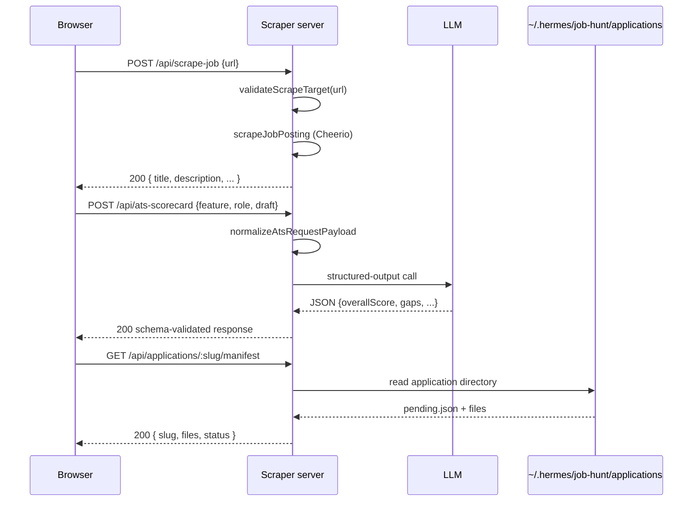

# Scraper server

Active contributors: emilio3435

## Purpose

`server/` is the optional Node Express service that powers three browser features that need server-side execution: **Fetch posting** (Cheerio scrape), **ATS scorecard**, and the **materials API** (Hermes-generated resume/cover-letter artifacts). It also hosts the canonical user profile, profile-from-resume conversion, and pipeline rescore worker. Default bind is `127.0.0.1:3847`; set `LISTEN_HOST=0.0.0.0` for hosted / container deployments.

## Directory layout

```
server/
├── index.mjs                    # Express entry; route registration
├── job-scraper.mjs              # Wrapper around shared scraper core
├── shared/job-scraper-core.mjs  # Cheerio-based scrape implementation (used by browser, tests, server)
├── ats-request-payload.mjs      # Normalization for ATS scorecard requests
├── ats-scorecard.mjs            # LLM call + schema enforcement for ATS scoring
├── application-materials.mjs    # Hermes-generated materials manifest reader
├── materials-quality.mjs        # Quality gates (sparse-resume, weak-letter)
├── materials-repair.mjs         # Repair-request payload builder
├── materials-request.mjs        # Spawns Hermes materials-request.sh
├── profile-from-resume.mjs      # Gemini structured output: resume → UserProfile
├── profile-rescore-worker.mjs   # Pipeline-wide rescore against canonical profile
├── legacy-profile-migrator.mjs  # Migrate old Hermes profile → v1 UserProfile JSON
├── user-profile.mjs             # Disk persistence + ajv validation + starter templates
├── security-boundaries.mjs      # CORS allowed-origin resolver + scrape target validator
├── ats-env.example              # Template for ATS provider env
└── package.json                 # Express, dotenv, cheerio
```

## Key abstractions

| Symbol | File | Role |
| --- | --- | --- |
| `app` | `server/index.mjs` | Express app instance, ~22k LOC of route registrations |
| `scrapeJobPosting` | `server/shared/job-scraper-core.mjs` | Cheerio scrape + heuristics; shared with the browser via `lib/` |
| `analyzeAtsScorecard` | `server/ats-scorecard.mjs` | Calls Gemini/OpenAI/Anthropic with a strict JSON schema |
| `normalizeAtsRequestPayload` | `server/ats-request-payload.mjs` | Validates event = `command-center.ats-scorecard`, features ∈ `{cover_letter, resume_update}` |
| `validateScrapeTarget` | `server/security-boundaries.mjs` | Blocks `localhost`, RFC1918, link-local, IPv6 ULA |
| `resolveAllowedBrowserOrigin` | `server/security-boundaries.mjs` | Matches request origin against the allow-list (supports `LISTEN_HOST`) |
| `readProfile` / `writeProfileAtomic` | `server/user-profile.mjs` | Read/write `~/.jobbored/profile.json` with ajv validation |
| `buildStarterTemplate` | `server/user-profile.mjs` | Returns seed templates by id |
| `analyzeResumeToProfile` | `server/profile-from-resume.mjs` | Reads stored resume text, returns UserProfile JSON (does not save) |
| `rescoreAllPipelineRows` | `server/profile-rescore-worker.mjs` | Walks every Pipeline row, re-scores against current profile |

## Routes

Full route list (registrations in `server/index.mjs`):

| Method | Path | Purpose |
| --- | --- | --- |
| `GET` | `/health` | Liveness + ATS config status |
| `POST` | `/api/scrape-job` | Cheerio scrape of a public job URL |
| `POST` | `/api/ats-scorecard` | Generate ATS analysis JSON |
| `GET` | `/profile` | Read canonical UserProfile |
| `POST` | `/profile` | Write canonical UserProfile |
| `POST` | `/profile/template/:id` | Build a starter template |
| `POST` | `/profile/from-resume` | Convert stored resume text → UserProfile via Gemini |
| `POST` | `/profile/migrate` | Migrate legacy Hermes profile → `~/.jobbored/profile.json` |
| `POST` | `/profile/rescore` | Rescore every Pipeline row against current profile |
| `GET` | `/api/applications` | List Hermes application slugs |
| `GET` | `/api/applications/queue` | List pending materials drafts |
| `GET` | `/api/applications/:slug/manifest` | Read a single application manifest |
| `POST` | `/api/applications/:slug/request` | Spawn Hermes `materials-request.sh` |
| `POST` | `/api/applications/:slug/repair` | Build a repair-request payload |
| `POST` | `/api/applications/:slug/dismiss` | Mark application dismissed |
| `GET` | `/api/applications/:slug/job-description` | Read JD file |
| `PUT` | `/api/applications/:slug/job-description` | Write JD file |
| `POST` | `/api/applications/:slug/scrape-job-description` | Scrape JD from URL |
| `GET` | `/api/applications/:slug/files/:filename` | Stream a generated file (PDF / DOCX / HTML) |

## How it works



### CORS

`server/security-boundaries.mjs` normalizes allowed origins from `COMMAND_CENTER_ALLOWED_ORIGINS`, `CORS_ALLOWED_ORIGINS`, or `ALLOWED_ORIGINS`, honoring `LISTEN_HOST` so local dev (`http://localhost:8080`, `http://127.0.0.1:8080`) works without extra config. Disallowed origins receive `403`.

### Scrape safety

`validateScrapeTarget` blocks loopback (`127.0.0.0/8`, `::1`), RFC1918, link-local, and `*.local` hosts. The intent is to prevent the local server from being used as an SSRF gateway when deployed to Render / Fly / similar.

### ATS providers

`server/ats-env.example` is the env template. Provider keys go in `server/.env` (gitignored) and are read via `dotenv`. `analyzeAtsScorecard` calls the configured provider with a JSON-schema-enforced output so no regex repair is needed.

### Materials lane

`application-materials.mjs` reads only directories under `getApplicationsRoot()` (defaults to `~/.hermes/job-hunt/applications/<slug>/`). `isValidSlug` is a strict ASCII guard. `writeJobDescription` keeps writes inside the slug directory.

## Integration points

- The browser calls this server directly from the same machine (`http://127.0.0.1:3847`).
- Hermes (Python) drops `pending.json` into the applications directory; this server surfaces it as a queue.
- The browser's "Fetch posting" can target the configured `jobPostingScrapeUrl` (local server or hosted deploy from `DEPLOY-SCRAPER.md`).

## Entry points for modification

- New route → register in `server/index.mjs`, reuse `security-boundaries` for CORS, add a test under `tests/`.
- New ATS provider → extend `server/ats-scorecard.mjs` and the `ats-env.example` template.
- New materials field → add to the manifest in `application-materials.mjs` and the v2 surface in `role-materials.js` / `materials-queue.js`.

## Tests

- `tests/server-security-boundaries.test.mjs`
- `tests/ats-request-transport-alignment.test.mjs`
- `tests/ats-scorecard-provider.test.mjs`
- `tests/application-materials.test.mjs`
- `tests/materials-request-endpoint.test.mjs`
- `tests/materials-repair.test.mjs`
- `tests/dev-server-https.test.mjs`
- `tests/fix-setup-endpoint.test.mjs`

## Related

- [Dashboard](dashboard.md) — the only client of `:3847`
- [Materials feature](../features/materials.md) — Hermes-generated artifacts
- [ATS scorecard feature](../features/ats-scorecard.md) — end-to-end flow
- [Configuration](../reference/configuration.md) — env vars + CORS
- [Deployment](../deployment.md) — how to host the scraper publicly
