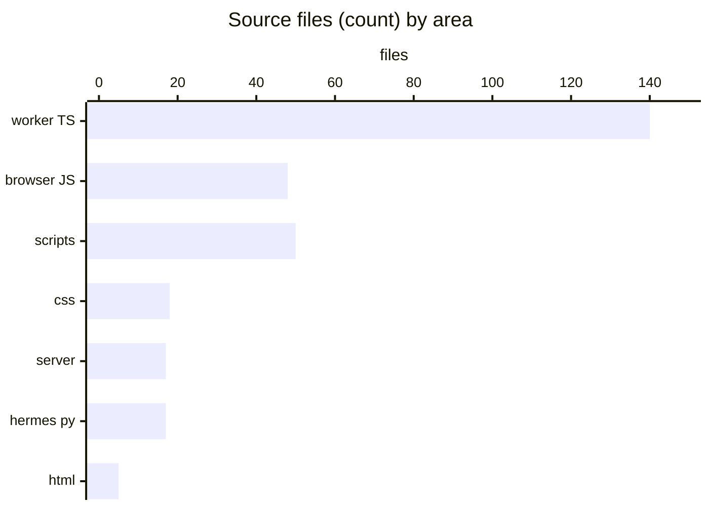
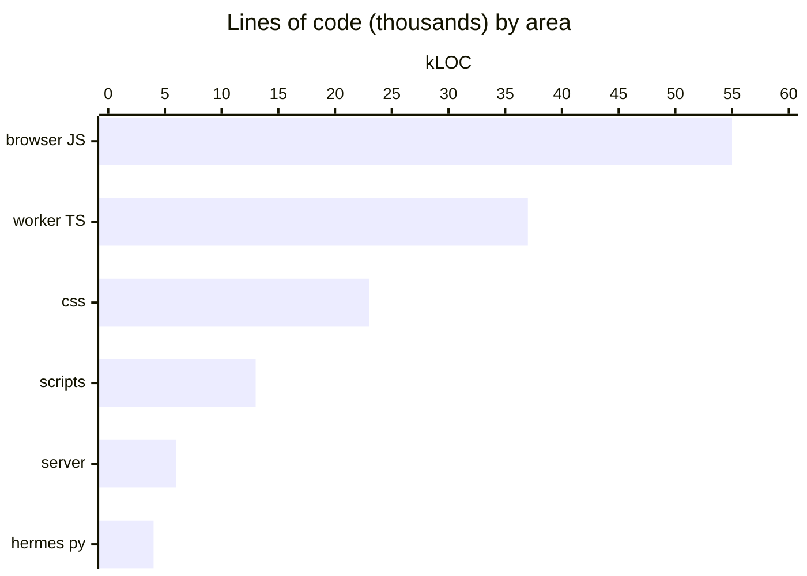
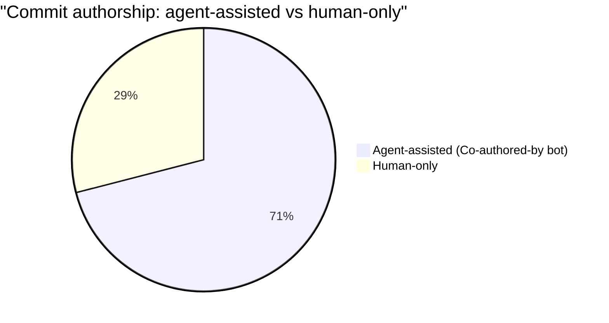

# By the numbers

Snapshot of the JobBored codebase. Numbers below were measured on `feat/seamless-discovery-coexistence` as of late May 2026.

## Languages and surface area

| Area | Files | LOC |
| --- | --- | --- |
| Root browser scripts (`*.js`) | 48 | ~54,700 |
| Root styles (`*.css`) | 18 | ~23,300 |
| Discovery worker TypeScript (`integrations/browser-use-discovery/src/**`) | ~140 | ~36,600 |
| Scripts (`scripts/*.mjs`) | ~50 | ~12,500 |
| Express server (`server/*.mjs`) | 17 | ~5,900 |
| Hermes Python (`integrations/hermes-job-hunt/scripts/*.py`) | 17 | ~4,100 |
| Root markdown docs | 26 | n/a |
| HTML | 5 (`index.html`, `brief-mockup.html`, demos) | n/a |

## Heaviest files

| Layer | File | LOC |
| --- | --- | --- |
| Browser | `app.js` | 24,289 |
| Worker | `integrations/browser-use-discovery/src/grounding/grounded-search.ts` | 4,132 |
| Worker | `integrations/browser-use-discovery/src/state/discovery-memory-store.ts` | 2,801 |
| Worker | `integrations/browser-use-discovery/src/run/run-discovery.ts` | 2,639 |
| Browser | `settings-profile-tab.js` | 2,472 |
| Worker | `integrations/browser-use-discovery/src/webhook/handle-discovery-profile.ts` | 2,224 |
| Browser | `role-materials.js` | 1,878 |
| Browser | `pipeline.js` | 1,796 |
| Browser | `discovery-wizard-shell.js` | 1,702 |
| CSS | `style.css` | 13,209 |

`app.js` is the elephant. It owns OAuth state, parsing, rendering, write-back, and discovery dispatch. See [cleanup opportunities](cleanup-opportunities.md).

## Tests

| Suite | Count |
| --- | --- |
| Root + discovery worker `*.test.*` files | 129 |

## Commits and authors

| Metric | Value |
| --- | --- |
| Total commits | 417 |
| Commits with bot / agent co-authors | 296 (~71%) |
| First commit | `0680bee` — 2026-04-08 |
| Latest commit | `67e5dc7` — 2026-05-30 |
| Active span | ~7 weeks |

| Contributor | Commits |
| --- | --- |
| emilio3435 | 414 |
| Command Center (bot) | 5 |
| emiliobuilds | 5 |
| Cursor Agent | 1 |

In other words: one human contributor (`emilio3435`) with heavy agent assistance (Claude Code, Factory Droid, Codex, Cursor, Warp — all visible in `Co-authored-by` lines).

## Source lanes

| Category | Count | Where |
| --- | --- | --- |
| ATS providers | 14 | `integrations/browser-use-discovery/src/browser/providers/` |
| Grounded web sources | 1 | `src/grounding/grounded-search.ts` |
| SerpApi sources | 1 | `src/sources/serpapi-google-jobs.ts` |

The 14 ATS providers: greenhouse, lever, ashby, workday, icims, smartrecruiters, workable, breezy, personio, recruitee, teamtailor, jobvite, taleo, successfactors.

## Themed modules

Twelve named-after-theme browser modules: dawn, lattice, pipeline (sticker board), role (Dossier), letter, scribe, flowing-{chrome, store, writes}, jb-ui, welcome, hermes (Python). See [glossary](overview/glossary.md) and [fun facts](fun-facts.md).

## See also

- [Lore](lore.md)
- [Cleanup opportunities](cleanup-opportunities.md)
- [Fun facts](fun-facts.md)
