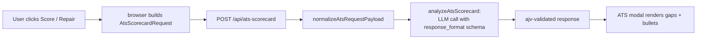

# ATS scorecard

LLM-backed ATS analysis: scores a candidate resume / cover-letter draft against a role, returning gap categories, recommended bullets, and an overall score. Triggered from the Dossier or Letter surface.

## Modules

| Layer | Files |
| --- | --- |
| Request payload | `lib/ats-request-payload.mjs` (browser shared), `server/ats-request-payload.mjs` |
| Server handler | `server/ats-scorecard.mjs` (LLM call + schema enforcement) |
| Schema | `schemas/ats-scorecard-request.v1.schema.json`, `schemas/ats-scorecard-response.v1.schema.json` |
| Browser entry | `letter.js`, `scribe.js`, `ats` UI in `app.js` |
| Retry | `ats-scorecard-retry.js` (browser) |
| Tests | `tests/ats-scorecard-provider.test.mjs`, `tests/ats-request-transport-alignment.test.mjs`, `tests/ats-scorecard-retry.test.mjs` |

## Flow

## Request shape

`event` is always `"command-center.ats-scorecard"`. `feature` is one of `cover_letter` or `resume_update`. The transport normalizer rejects unknown features so providers don't quietly accept the wrong analysis prompt.

## Schema enforcement

The server passes the response schema to the LLM as `response_format` / structured output, then ajv-validates the returned JSON. If validation fails, the retry path in `ats-scorecard-retry.js` rebuilds the request with the validation error injected as context.

## Events

The browser dispatches `jb:ats:state` / `jb:ats:state:request` / `jb:ats:modal:open`. Workers building Direction F (the OpenClaw-style action lane) should not rename these.

## Tests

- `tests/ats-scorecard-provider.test.mjs`
- `tests/ats-request-transport-alignment.test.mjs`
- `tests/ats-scorecard-retry.test.mjs`
- `npm run test:ats-contract` — schema vs sample vs server alignment

## Related

- [Scraper server](../apps/scraper-server.md)
- [Materials](materials.md)
- [Patterns and conventions](../how-to-contribute/patterns-and-conventions.md)
