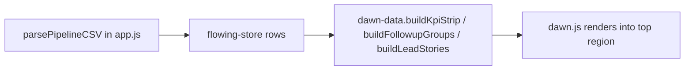

# Daily Brief

Top-of-dashboard summary surface: today's follow-ups, "waiting on" replies, stuck applications, recent wins, and a KPI strip. Implemented by `dawn.js` + `dawn-data.js` + `dawn.css`.

## Modules

| File | Role |
| --- | --- |
| `dawn-data.js` | Builds view-models from the Pipeline rows. Pure, testable. |
| `dawn.js` | DOM renderer. Reads view-models, paints the brief. |
| `dawn.css` | Brief styles |
| `DAWN.md` | Design intent + contract for the view-models |

## View-models

`dawn-data.js` exposes functions like `buildLeadStories`, `buildFollowupGroups`, `buildKpiStrip`. Each takes the parsed Pipeline rows and returns a typed shape. The renderer cannot read `data-*` attributes that view-models depend on if they are emitted as empty strings — see [pipeline](pipeline.md).

## Data path

## Tests

- `tests/dawn-data-lead-stories.test.mjs`
- `tests/dawn-data-kpi.test.mjs`
- `tests/dawn-data-followups.test.mjs`

## Related

- [Pipeline](pipeline.md)
- [Glossary: Dawn](../overview/glossary.md)
