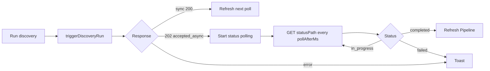

# Discovery

End-to-end feature for "fill my Pipeline with new candidate jobs". Composed of the Run discovery button, the Discovery drawer wizard, the async run status polling, and the user-owned receiver (default: the bundled discovery worker).

## Surface

The Discovery drawer has sub-tabs:

- **Search** — quick query, filters by stage / source preset
- **Sources** — toggles per source lane
- **Automation** — schedule + cadence (see [schedule](schedule.md))
- **Connection** — webhook URL, secret, transport, auto-setup
- **History** — read of the `DiscoveryRuns` sheet tab (see [runs](runs.md))

Implemented by `discovery-wizard-shell.js` + `discovery-wizard-local.js` + `discovery-wizard-relay.js` + `discovery-wizard-probes.js` + `discovery-wizard-verify.js` + `discovery-wizard-helpers.js`.

## Dispatch

The Run discovery button calls `triggerDiscoveryRun` in `app.js:10248`. It uses `discovery-payload.js` (shared with tests) to build the payload, POSTs to the configured webhook URL, and handles three response shapes:

`statusPath` is preserved verbatim — hosted workers embed a `statusToken` query param that is per-run. Polling must tolerate both `statusPath` and `status_path` for older receivers.

## Contract

`schemas/discovery-webhook-request.v1.schema.json` is authoritative. See [discovery webhook API](../api/discovery-webhook.md) for the full payload table.

## Auto-setup (local worker)

The wizard's "Auto-setup" path runs `npm run discovery:bootstrap-local` under the hood (via `scripts/bootstrap-local-discovery.mjs`). It:

1. Ensures the local worker config + env files exist under `~/.jobbored/browser-use-discovery/`.
2. Starts the worker on `127.0.0.1:8644`.
3. Starts an ngrok tunnel.
4. Optionally deploys / updates a Cloudflare Worker relay so the browser can hit a stable HTTPS URL.
5. Writes the resolved webhook URL into the dashboard's settings.

`scripts/discovery-keep-alive.mjs` watches for ngrok tunnel rotation and re-points the relay if the upstream changes.

## Tests

- `tests/discovery-payload-builder.test.mjs`
- `tests/discovery-bootstrap-transport.test.mjs`
- `tests/discovery-wizard-helpers.test.mjs`
- Worker side: `integrations/browser-use-discovery/tests/webhook/handle-discovery-webhook.test.ts`

## Related

- [Discovery worker app](../apps/discovery-worker/index.md)
- [Discovery webhook API](../api/discovery-webhook.md)
- [Cloudflare relay](../deployment.md#cloudflare-relay)
