# Materials (Resume + Cover Letter)

Generate role-tailored resume and cover-letter artifacts. Two paths:

- **In-browser BYOK** — `resume-bundle.js` + `resume-generate.js` call the user's chosen LLM (Gemini / OpenAI / Anthropic) and produce DOCX / HTML via `document-templates.js` + `visual-themes.js`.
- **Hermes lane** — the dashboard requests `POST /api/applications/:slug/request`; the scraper server spawns `materials-request.sh`; Hermes drops files under `~/.hermes/job-hunt/applications/<slug>/`; the dashboard's materials queue polls and renders them in the Dossier.

## Modules

| Lane | Files |
| --- | --- |
| BYOK | `resume-bundle.js`, `resume-generate.js`, `document-templates.js`, `visual-themes.js`, `letter.js`, `scribe.js` |
| Hermes request | `server/materials-request.mjs`, `server/application-materials.mjs`, `integrations/hermes-job-hunt/scripts/materials-request.sh` |
| Hermes repair | `server/materials-repair.mjs` |
| Quality gates | `server/materials-quality.mjs` (sparse-resume, weak-letter detection) |
| Queue UI | `materials-queue.js`, `role-materials.js` |
| Profile | `server/user-profile.mjs`, `server/profile-from-resume.mjs` |
| Resume input | `fit-profile-wizard.js`, `user-content-store.js` (IndexedDB) |

## Flow (Hermes lane)

```mermaid
graph LR
    A[User opens Dossier] --> B[Materials tab]
    B --> C[Request materials]
    C --> D[POST /api/applications/:slug/request]
    D --> E[server spawns materials-request.sh]
    E --> F[Hermes drafts via LLM]
    F --> G[Files land under ~/.hermes/job-hunt/applications/:slug/]
    G --> H[materials-queue.js polls /api/applications]
    H --> I[role-materials.js renders preview + download]
    I --> J[Quality gates flag sparse-resume / weak-letter]
    J --> K[User clicks Repair → POST /api/applications/:slug/repair]
```

## Quality gates

`server/materials-quality.mjs` runs two checks on every drafted artifact:

- **Sparse resume** — resume body length / unique bullet count below thresholds.
- **Weak letter** — letter sentence count, JD echo ratio, or missing canonical phrases.

A failure surfaces in the dashboard as a "Repair" CTA. Repair sends back the original draft + the gate reason; Hermes re-drafts with targeted prompts.

## Profile

The canonical UserProfile lives at `~/.jobbored/profile.json`. The schema is `server/contracts/user-profile.schema.json` (and its TypeScript twin). The server exposes:

- `GET /profile` / `POST /profile`
- `POST /profile/template/:id` — starter templates
- `POST /profile/from-resume` — parse a stored resume into a profile via Gemini structured output
- `POST /profile/migrate` — migrate the older Hermes-local profile
- `POST /profile/rescore` — walk every Pipeline row, rescore against the current profile

The browser-side IndexedDB stash (`user-content-store.js`) holds the raw resume text / DOCX bytes / samples — the canonical structured profile lives on disk.

## Tests

- `tests/application-materials.test.mjs`
- `tests/materials-request-endpoint.test.mjs`
- `tests/materials-repair.test.mjs`
- `tests/materials-quality.test.mjs`
- `tests/profile-from-resume.test.mjs`
- `tests/profile-rescore-worker.test.mjs`
- `tests/resume-generate.test.mjs`

## Related

- [Scraper server](../apps/scraper-server.md)
- [Hermes](../apps/hermes.md)
- [Pipeline & Dossier](pipeline.md)
