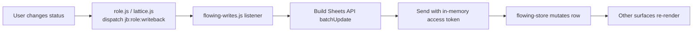

# Pipeline & Dossier

The Pipeline is the main spine of the product. The user sees rows from the Google Sheet rendered as cards in two main layouts (v1 kanban-ish, v2 horizontal sticker board), can expand any card into the Dossier surface, and can write back stage / notes / reply state directly.

## Modules

| Layer | Files |
| --- | --- |
| Sheet read | `app.js:parsePipelineCSV` (`app.js:12340`), `gviz` JSONP fallback to Sheets API v4 |
| v1 card render | `app.js:renderCardActions` (`app.js:13699`), `style.css` |
| v2 sticker board | `pipeline.js`, `pipeline.css` |
| v2 kanban | `lattice.js`, `lattice.css` |
| Dossier (PART 03) | `role.js`, `role-brief.js`, `role-materials.js`, `role.css` |
| Shared store | `flowing-store.js` |
| Write-back | `flowing-writes.js` (v2), `app.js` write helpers (v1) |
| Card data attrs spec | `AGENT_CONTRACT.md` "v2 kanban-card data-attributes" |
| Tests | `tests/dossier-card-attrs.test.mjs`, `tests/pipeline-filter-controls.test.mjs`, `tests/role-tabs.test.mjs` |

## Read path

`parsePipelineCSV` is the single entry point. Column indices are driven by `schemas/pipeline-row.v1.json` — never hand-write column letters in another module.

Cards in v2 carry `data-stable-key` plus `data-*` attributes for stage, priority, comp, location, fit score, source, posted-at, follow-up. Empty values are **omitted entirely**, not emitted as `data-foo=""`. Tests in `tests/dossier-card-attrs.test.mjs` enforce this — view-models in `dawn-data.js` rely on it.

## Write path

Allowed fields: `stage`, `heardBack`, `reply`, `followupAt`, `passed`. Anything else falls back to the legacy `app.js` write path.

## Dossier

`role.js` is the expand controller. The Dossier has three tabs:

- **Brief** (`role-brief.js`) — AI summary, fit vs role, must-haves/nice-to-haves
- **Materials** (`role-materials.js`) — Hermes-generated resume + letter
- **Notes** — sheet column write-back

`AGENT_CONTRACT.md` "Dossier event family" lists all `jb:role:*` events. Workers building Direction F must not rename or reshape these.

## Filters and ordering

`tests/pipeline-filter-controls.test.mjs` covers the stage / priority / source filters. v2 surfaces use the same filter state but render differently. `flowing-store.js` is the shared filter store.

## Related

- [Dashboard app](../apps/dashboard.md)
- [Daily Brief](daily-brief.md) — reads the same rows for its summary
- [Pipeline schema](../reference/data-models.md)
