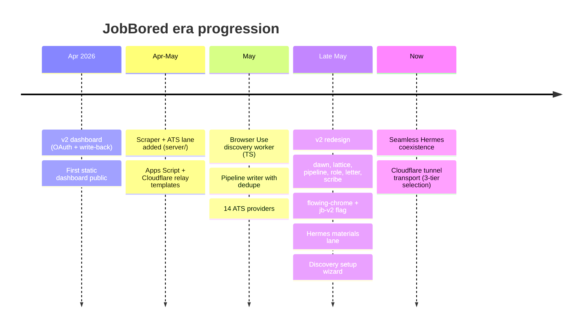

# Lore

History of JobBored — what it grew from, the rewrites and pivots, the deprecated paths still visible in the repo.

## Origins: "Command Center"

The repo is named **JobBored** publicly, but inside the code it is **Command Center**. Every internal config key (`window.COMMAND_CENTER_CONFIG`), event (`command-center.discovery`, `command-center.ats-scorecard`), and webhook payload preserves the original name. The renaming happened externally; the codebase didn't bother to flip.

The first commit (`0680bee`) on 2026-04-08 was already a "v2": OAuth auth, write-back, toast system, config, setup screen. There is no surviving v1; it lived in a previous repo the user iterated against.

## Eras visible in the codebase

## Big migrations

- **v1 → v2 chrome**. `body.jb-v2` gates the redesign. v1 styles live in `style.css` (the 13k-line monolith). v2 is split per surface (`dawn.css`, `lattice.css`, `pipeline.css`, `role.css`, `letter.css`, `scribe.css`). Both render today; v2 is increasingly default.
- **Workshop → Dossier (PART 03)**. Earlier role view was `role-workshop.js`. The Dossier is `role.js` + `role-brief.js` + `role-materials.js`. The workshop file is still present — see [cleanup opportunities](cleanup-opportunities.md).
- **Hermes-local profile → canonical UserProfile**. Hermes used to own its own profile JSON. The canonical profile is now `~/.jobbored/profile.json`, managed by `server/user-profile.mjs`. A migrator (`server/legacy-profile-migrator.mjs`) bridges the gap.
- **Polling shape**. Older receivers responded with `status_path` snake_case; the dashboard tolerates both `statusPath` and `status_path`. New code emits camelCase.
- **Schedule infra**. Earlier schedules were a per-OS shell script; now there's a generated cross-platform installer plus an optional GitHub Actions workflow. Walkthrough in `docs/SETTINGS-SCHEDULE.md`.

## Deprecated / shelved features

- **Apply-bot Gates 2 / 4** (Hermes). The repo still references gates 2 (form readiness) and 4 (submit confirmation) in handoff notes. They are not wired into the active materials lane — Hermes only operates on gates 0 / 3 / 5 today.
- **Apps Script discovery stub**. `integrations/apps-script/` ships a `doPost` stub that returns `{ ok: true }` and (optionally) appends a `[CC test]` row. Useful for smoke-testing the dashboard wiring; not a real discovery engine.
- **Backend Handoff**. `BACKEND_HANDOFF.md` is from a brief moment when a hosted backend was considered. The project then committed to "no maintainer-hosted service" — the file remains as historical context.

## Renames and aliases

- `command-center.discovery` event → external "Run discovery" UI label
- `discoveryProfile` → was `userProfile` in pre-v1 contracts; renamed for scope clarity
- `googleAccessToken` → the contract calls it that even though the worker also accepts service-account / OAuth-file paths

## Document graveyard

The repo's root markdown has accumulated 26 files; many are handoff snapshots from earlier sessions. Key archeology:

- `MIGRATION.md` — v1 → v2 migration plan
- `TECH_DEBT_REPORT.md` — explicit debt inventory
- `WORKSPACE_BRIEF.md` — original product brief
- `HANDOFF-*.md`, `RUNS_LOG_HANDOFF.md`, `TIER1_DEFAULT_HANDOFF.md`, `HERMES_MATERIALS_HANDOFF.md`, `PIPELINE-CARDS-HANDOFF.md`, `RUNS_POLISH_HANDOFF.md`, `BACKEND_HANDOFF.md` — session handoff notes that the human reads to refresh context
- `docs/handoffs/` and `docs/planning-handoffs/` — more recent handoffs by topic
- `docs/swarm/` and `docs/redesign/` — multi-agent and redesign planning notes

These are not authoritative for the running code. The five canonical docs are `README.md`, `SETUP.md`, `AGENT_CONTRACT.md`, `AGENTS.md`, `DESIGN.md`.

## Co-authorship pattern

Of 417 commits, 296 (~71%) include a `Co-authored-by:` line attributing an agent (Factory Droid, Claude Code, Cursor, Warp, Codex). The single human author (`emilio3435`) explicitly built this repo as a "directional-prompting" exercise — multiple AI tools collaborating on one product with strict invariants. See `AGENTS.md` for the rules they all defer to.

## Related

- [By the numbers](by-the-numbers.md)
- [Cleanup opportunities](cleanup-opportunities.md)
- [Fun facts](fun-facts.md)
