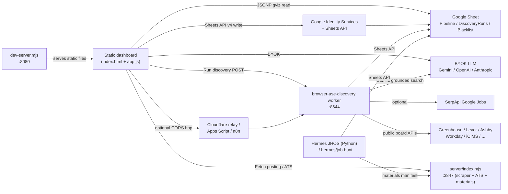
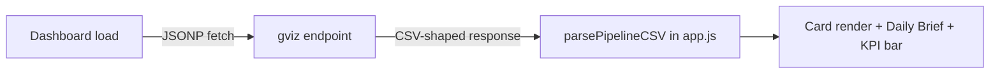
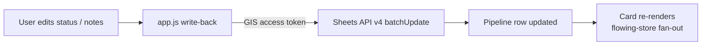
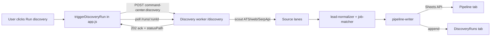
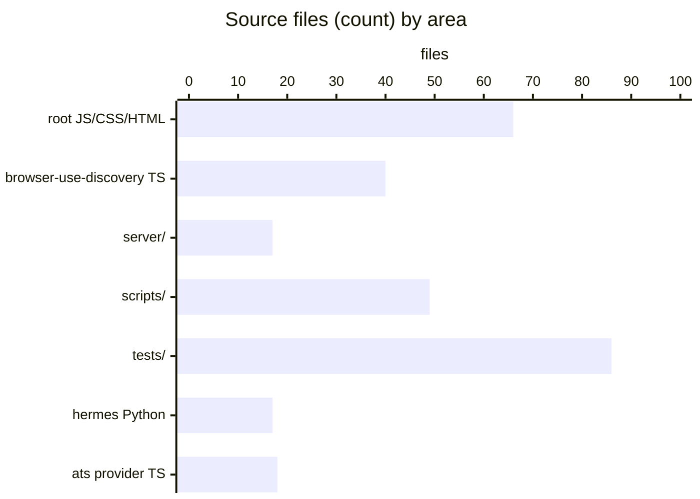
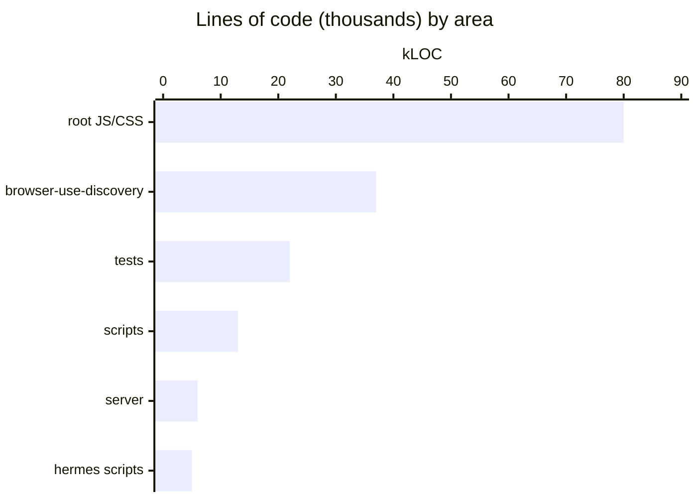

# Architecture

JobBored is composed of one always-present static dashboard plus several optional Node services. They communicate through HTTP and through the user's Google Sheet. There is no maintainer-hosted service; every runtime piece runs in the user's account or on the user's machine.

## Runtime composition

## The three lanes

- **Browser dashboard** — `index.html` + ~50 root JS files load in deliberate order. `app.js` (24k LOC) owns most behavior. v2 chrome (`flowing-*`, `pipeline.js`, `lattice.js`, `dawn.js`, `role.js`, `letter.js`, `scribe.js`) renders the redesigned surfaces when `body.jb-v2` is set.
- **Optional local server** — `server/index.mjs` is the Express scraper + ATS scorecard + materials API. It also hosts the user-profile and rescore endpoints.
- **Optional discovery worker** — `integrations/browser-use-discovery/src/server.ts` accepts the `command-center.discovery` webhook, runs a scout → score → exploit → learn loop across ATS / grounded web / SerpApi lanes, and writes Pipeline rows back to the Sheet.

## Data flow: read

Reads use Google's `gviz` JSONP endpoint, so no OAuth is required when the sheet is published or shared "anyone with the link". Signed-in users use the Sheets API.

## Data flow: write

OAuth access tokens stay in browser memory only; they are never persisted (see [security](../security.md)).

## Data flow: discovery

The webhook contract is documented in `AGENT_CONTRACT.md` and `schemas/discovery-webhook-request.v1.schema.json`. The worker is one valid receiver; Apps Script, n8n, GitHub Actions, or any other user-owned endpoint can take its place.

## Codebase shape

Source distribution (rough, no `.lock` / generated files):

The single biggest file is `app.js` (~24k lines), the second is `style.css` (~13k). The discovery worker's `run-discovery.ts` is the largest TypeScript file (~2.6k lines). See [by-the-numbers](../by-the-numbers.md) for the full breakdown.

## Script loading order

The order of `<script>` tags in `index.html` is load-bearing. None of the root JS files use ES modules; many publish APIs on `window`. The high-level order is:

1. Vendor (`gsi/client`) and fonts
2. Visual themes + document templates (`document-templates.js`, `visual-themes.js`)
3. User content store (`user-content-store.js`) — IndexedDB
4. v2 surfaces (`jb-ui.js`, `welcome.js`, `lattice.js`, `dawn-*.js`, `flowing-*.js`, `pipeline.js`, `role*.js`, `letter.js`, `scribe.js`)
5. Discovery wizard modules (`discovery-wizard-*.js`)
6. Resume/profile (`resume-bundle.js`, `resume-generate.js`, `fit-profile-*.js`)
7. Config (`config.js` generated from `config.example.js`)
8. Settings (`settings-tab-schema.js`, `settings-tabs.js`, `settings-profile-tab.js`, …)
9. Runs / companies (`runs-tab.js`, `companies-tab.js`)
10. `app.js` — main controller

Adding a new module requires placing it correctly in this chain in `index.html`.

## Cross-references

- [Apps overview](../apps/index.md) for per-runtime detail
- [Features overview](../features/index.md) for product capabilities
- [API overview](../api/index.md) for HTTP surface
- [Patterns and conventions](../how-to-contribute/patterns-and-conventions.md) for coding norms
