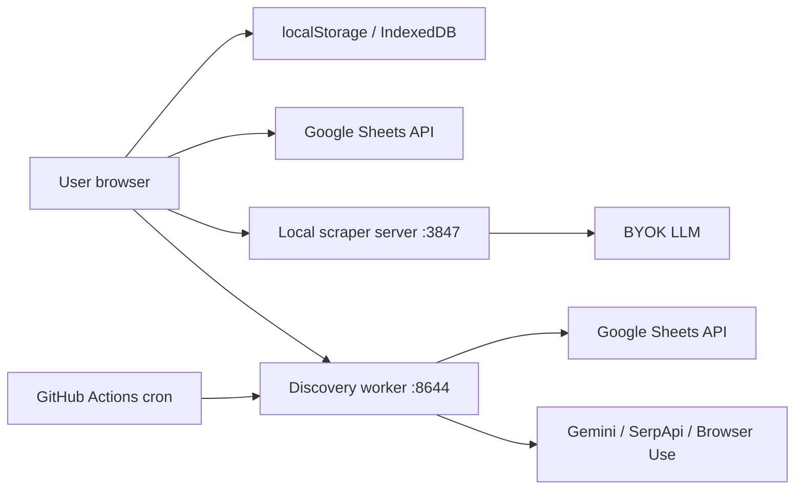

# Security

Trust boundaries, secret handling, and the threat model. See `SECURITY.md` in the repo root for vuln reporting.

## Threat model in one sentence

The user is in control. Nothing in this repo is meant to live in front of strangers — no maintainer-hosted service, no shared multi-tenant state, no third-party API key custody.

## Trust boundaries

- Browser ↔ Sheets — OAuth via Google Identity Services. Access tokens stay in browser memory. Never persisted to disk.
- Browser ↔ scraper server — same-origin loopback in local dev. Public deployments must set `COMMAND_CENTER_ALLOWED_ORIGINS`.
- Browser ↔ discovery worker — `Authorization: Bearer <webhook-secret>` in hosted mode. In local mode the secret is optional.
- Worker ↔ Sheets — per-request `googleAccessToken` (preferred), or worker-side service account / OAuth file.

## Secret storage

| Secret | Where it lives | Rotation |
| --- | --- | --- |
| Google OAuth access token | Browser memory only | New token each session |
| `DISCOVERY_WEBHOOK_SECRET` | Worker env, dashboard `localStorage` | User-controlled |
| Per-run `statusToken` | Worker run-status store | Per run; expires with terminal state |
| Gemini / OpenAI / Anthropic / SerpApi keys | Browser `localStorage` (BYO LLM) or `server/.env` (ATS lane) | User-controlled |
| `BROWSER_USE_API_KEY` | Worker env | User-controlled |
| Service account JSON | `BROWSER_USE_DISCOVERY_SERVICE_ACCOUNT_JSON` or `_FILE` | Rotate via GCP |

No secret is ever written to logs. The discovery worker's `logEvent` is the only logger; tokens are stripped at the contract validation step.

## Stripping `googleAccessToken`

This is the most security-critical invariant in the repo:

1. The token arrives in the webhook body.
2. `handle-discovery-webhook.ts` strips it before any further work.
3. It is consumed for the Sheets calls of that run only.
4. It never reaches the memory store, the run-status store, logs, or stdout.

Tests in `integrations/browser-use-discovery/tests/webhook/` assert this. Don't reorder the handler steps without updating the tests.

## Scrape SSRF guard

`server/security-boundaries.mjs::validateScrapeTarget` rejects:

- IPv4 loopback (`127.0.0.0/8`)
- IPv6 loopback (`::1`)
- RFC1918 (`10.0.0.0/8`, `172.16.0.0/12`, `192.168.0.0/16`)
- Link-local (`169.254.0.0/16`)
- `*.local` hostnames

This prevents the scraper from being used as an SSRF gateway when deployed publicly.

## CORS

Both the scraper server and the discovery worker enforce origin allow-lists. The defaults work for local dev; hosted deployments must set the allow-list explicitly.

## Apps Script stub safety

The Apps Script `doPost` stub is a smoke-test receiver. It returns `{ ok: true }` for any well-formed payload. Users who deploy it as their actual webhook receiver should set `ENABLE_TEST_ROW=false` once they're past smoke testing — otherwise every dashboard click appends a `[CC test]` row.

## Cloudflare relay surface

The relay's only routes are `/discovery`, `/runs/:runId`, and `/health`. It refuses everything else. Optional `SHARED_SECRET` requires `Authorization: Bearer <secret>` on `/discovery` + `/runs/...` (but not `/health` so the dashboard can detect relay liveness).

## Public-host caveats

- Don't host a public dashboard with secrets baked into `config.js`. Use the empty template and let users paste their own IDs.
- Don't share an LLM key with users by hosting a shared scraper server — each user should host their own.
- If you host a discovery worker for friends, set `DISCOVERY_WEBHOOK_SECRET` and rotate it.

## Reporting

See `SECURITY.md` in the repo root for the disclosure channel.
