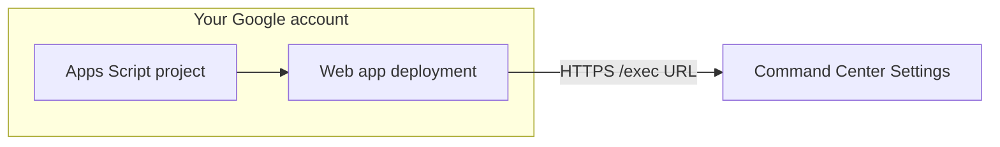

# Apps Script discovery webhook — visual walkthrough

This page is the **step-by-step** guide. Skim the [decision box](#before-you-start-pick-a-path) first, then follow **one** path (browser-only **or** clasp).  
**You do not need webhooks to use Command Center** — see [Discovery paths (no webhook options)](../../docs/DISCOVERY-PATHS.md).

---

## Before you start: pick a path

| If you…                                 | Do this                                                                                                |
| --------------------------------------- | ------------------------------------------------------------------------------------------------------ |
| Prefer **no install** (only a browser)  | [Path 1 — Browser only](#path-1-browser-only-recommended-for-first-time)                               |
| Want **local files** + `git` + terminal | [Path 2 — clasp (CLI)](#path-2-clasp-cli)                                                              |
| Already have a Sheet                    | Have the **Sheet ID** ready ([where?](#where-is-my-sheet-id))                                          |
| Want to **avoid** webhooks entirely     | [Discovery paths](../../docs/DISCOVERY-PATHS.md) — use manual rows, scheduling, or GitHub Actions only |

**Time:** first deploy usually **15–30 minutes** (mostly Google permission screens). **Second deploy** is faster: push code + update deployment.

---

## What you will have at the end

- An **HTTPS URL** ending in **`/exec`** (your “webhook URL”).
- That URL pasted into Command Center **Settings → Discovery webhook URL** and saved.
- (Optional) A passing check: **`npm run test:discovery-webhook`** from the repo.



---

## Where is my Sheet ID?

1. Open your [Google Sheet](https://docs.google.com/spreadsheets).
2. Look at the **browser address bar**:

   ```
   https://docs.google.com/spreadsheets/d/THIS_LONG_ID_IS_THE_SHEET_ID/edit
   ```

3. Copy **only** the long id between `/d/` and `/edit`.

You will paste this id into **Script properties** as `SHEET_ID` and it must match the Sheet ID in **Command Center** config / Settings.

---

## Path 1 — Browser only (recommended for first time)

### Step 1 — Open Apps Script

| #   | Action                                                                                                         |
| --- | -------------------------------------------------------------------------------------------------------------- |
| 1   | Open **[script.google.com](https://script.google.com)** (sign in with the Google account that owns the Sheet). |
| 2   | Click **New project** (blank project).                                                                         |

You should see a **Code.gs** tab with a default `function myFunction()`.

---

### Step 2 — Replace the code

| #   | Action                                                                        |
| --- | ----------------------------------------------------------------------------- |
| 1   | Open this repo’s **[Code.gs](./Code.gs)** in GitHub or your clone (raw file). |
| 2   | **Select all** text in the Apps Script editor `Code.gs` and delete it.        |
| 3   | **Paste** the full contents of our **`Code.gs`** file.                        |
| 4   | Click **Save** (disk icon) or **Ctrl/Cmd + S**.                               |

---

### Step 3 — Script properties (`SHEET_ID`)

| #   | Action                                                                                           |
| --- | ------------------------------------------------------------------------------------------------ |
| 1   | Left sidebar: **Project Settings** (gear icon).                                                  |
| 2   | Scroll to **Script properties** → **Add script property**.                                       |
| 3   | Property: **`SHEET_ID`** — Value: **your Sheet ID** (see [above](#where-is-my-sheet-id)).        |
| 4   | (Optional) Add **`ENABLE_TEST_ROW`** = **`true`** to append one test row per POST for debugging. |

The default stub only confirms webhook wiring. It does **not** fetch or append
real job leads unless you replace it with real discovery logic. In the
dashboard, this means **stub-only mode**, not “real discovery connected.”

---

### Step 4 — Authorize

| #   | Action                                                                                           |
| --- | ------------------------------------------------------------------------------------------------ |
| 1   | Click **Run** (top) — choose **doPost** if you’re asked, or run any function once to force auth. |
| 2   | Complete **Google’s permission** review (Advanced → allow if needed).                            |
| 3   | The script needs **Google Sheets** access for your spreadsheet.                                  |

---

### Step 5 — Deploy as Web App

| #   | Action                                                                                     |
| --- | ------------------------------------------------------------------------------------------ |
| 1   | Top right: **Deploy** → **New deployment**.                                                |
| 2   | Click the gear / **Select type** → choose **Web app**.                                     |
| 3   | **Execute as:** **Me**                                                                     |
| 4   | **Who has access:** start with **Anyone** (simplest for testing; tighten later if needed). |
| 5   | **Deploy** → copy the **Web app URL** (must end with **`/exec`**).                         |

**Keep this URL private** — treat it like an API endpoint.

---

### Step 6 — Command Center

| #   | Action                                                             |
| --- | ------------------------------------------------------------------ |
| 1   | Open your dashboard (local or hosted).                             |
| 2   | **Settings** (or header gear).                                     |
| 3   | **Discovery webhook URL** → paste the **`/exec`** URL (no spaces). |
| 4   | **Save** (reload if prompted).                                     |

Optional deep link from the repo docs: append **`?setup=discovery`** to the dashboard URL to focus that field (see [README URL parameters](../../README.md#url-parameters)).

---

### Step 7 — Verify

| #   | Action                            |
| --- | --------------------------------- |
| 1   | From the **Job-Bored repo root**: |

     ```bash
     npm run test:discovery-webhook -- --url "PASTE_EXEC_URL" --sheet-id "YOUR_SHEET_ID"
     ```

| 2 | In Apps Script: **Executions** (clock icon) — confirm the run **Succeeded**. |
| 3 | If `ENABLE_TEST_ROW` is `true`, open Sheet **Pipeline** — look for **`[CC test]`**. |

**CORS:** If the **browser** shows an error but **`npm run test:discovery-webhook`** passes, the endpoint works; use [GitHub Actions](../../templates/github-actions/README.md) or a [Cloudflare Worker](../../templates/cloudflare-worker/README.md) — see [CORS section](#cors-and-the-run-discovery-button) below. Those options only fix browser delivery; they do **not** make the stub discover jobs.

---

## Path 2 — clasp (CLI)

Use this when you want **`Code.gs` in git** and **`clasp push`** instead of pasting in the browser.

### Prerequisites

| Requirement                           | Link / command                                      |
| ------------------------------------- | --------------------------------------------------- |
| Node.js **18+**                       | [nodejs.org](https://nodejs.org/)                   |
| This repo cloned                      | `git clone …`                                       |
| **clasp** via npx (no global install) | Repo helper: `npm run apps-script:push` (see below) |

---

### Step 1 — Login once

```bash
cd /path/to/Job-Bored
npm run apps-script:login
```

Or from `integrations/apps-script`:

```bash
cd /path/to/Job-Bored/integrations/apps-script
npx -y @google/clasp login
```

A **browser window** opens for Google OAuth. Finish login, return to the terminal.

---

### Step 2 — Create or link a project

**New project:**

```bash
cd /path/to/Job-Bored/integrations/apps-script
npx -y @google/clasp create --type standalone --title "Command Center discovery webhook"
```

This creates **`integrations/apps-script/.clasp.json`** (gitignored — do not commit).

**Existing project:** copy [`.clasp.json.example`](./.clasp.json.example) → `.clasp.json` and set **`scriptId`** from [script.google.com](https://script.google.com) → **Project Settings**.

---

### Step 3 — Push code

From the **repo root**:

```bash
npm run apps-script:push
```

Or manually:

```bash
cd integrations/apps-script && npx -y @google/clasp push
```

---

### Step 4 — Script properties

Same as [Path 1 — Step 3](#step-3-script-properties-sheet_id): **Project Settings** → **Script properties** → `SHEET_ID` (and optional `ENABLE_TEST_ROW`).

---

### Step 5 — First Web App deploy

**clasp cannot fully skip the first Deploy UI** (Execute as / Who has access) for most accounts.

| #   | Action                                                                                                                 |
| --- | ---------------------------------------------------------------------------------------------------------------------- |
| 1   | `npm run apps-script:open` **or** `npx -y @google/clasp open` from `integrations/apps-script`.                         |
| 2   | In the browser: **Deploy** → **New deployment** → **Web app** (same as [Path 1 — Step 5](#step-5--deploy-as-web-app)). |
| 3   | Copy the **`/exec`** URL.                                                                                              |

Later code changes: **`npm run apps-script:push`** then **Deploy** → **Manage deployments** → **New version** on that deployment, or:

```bash
cd integrations/apps-script && npx -y @google/clasp deploy
```

---

### Step 6 — Command Center + verify

Same as [Path 1 — Steps 6–7](#step-6--command-center).

---

## CORS and the “Run discovery” button

Browsers send **`fetch`** from **your** dashboard origin. **Apps Script** often returns responses **without** the CORS headers some browsers expect, so the **UI** may show an error **even when** the script ran.

| Symptom                                                      | What to do                                                                                                                                                                                   |
| ------------------------------------------------------------ | -------------------------------------------------------------------------------------------------------------------------------------------------------------------------------------------- |
| `npm run test:discovery-webhook` **OK**, dashboard **error** | Expected for many hosts — use [GitHub Actions](../../templates/github-actions/README.md) for server-side POSTs, or a [Cloudflare Worker](../../templates/cloudflare-worker/README.md) relay. |
| Both fail                                                    | Check **Executions**, **Script properties**, and **Sheet ID** match.                                                                                                                         |

---

## Troubleshooting

| Problem                                          | What to check                                                                                                 |
| ------------------------------------------------ | ------------------------------------------------------------------------------------------------------------- |
| `sheetId mismatch`                               | `SHEET_ID` in Script properties **equals** the Sheet ID in the POST body / Command Center config.             |
| `Permission denied`                              | Re-run authorization; ensure the Sheet is in the **same Google account** as the script (or shared correctly). |
| No `Pipeline` tab / `Sheet "Pipeline" not found` | Your Sheet must have a tab named **Pipeline** (template).                                                     |
| Empty response                                   | Use **POST**; **GET** only returns a small JSON stub (`doGet`).                                               |

---

## Who needs to deploy?

**Each person (or team) who wants their own HTTPS webhook** deploys **their own** Apps Script project. The repo holds **shared templates** (`Code.gs`, `appsscript.json`) — not a single global URL. See [README — scope](./README.md).

---

## Files in this folder

| File                                         | Role                                    |
| -------------------------------------------- | --------------------------------------- |
| [Code.gs](./Code.gs)                         | `doPost` receiver                       |
| [appsscript.json](./appsscript.json)         | Manifest (V8, Sheets scope)             |
| [README.md](./README.md)                     | Short reference + CORS                  |
| [.clasp.json.example](./.clasp.json.example) | Template for linking an existing script |
